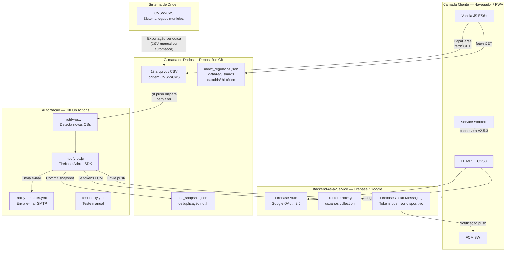
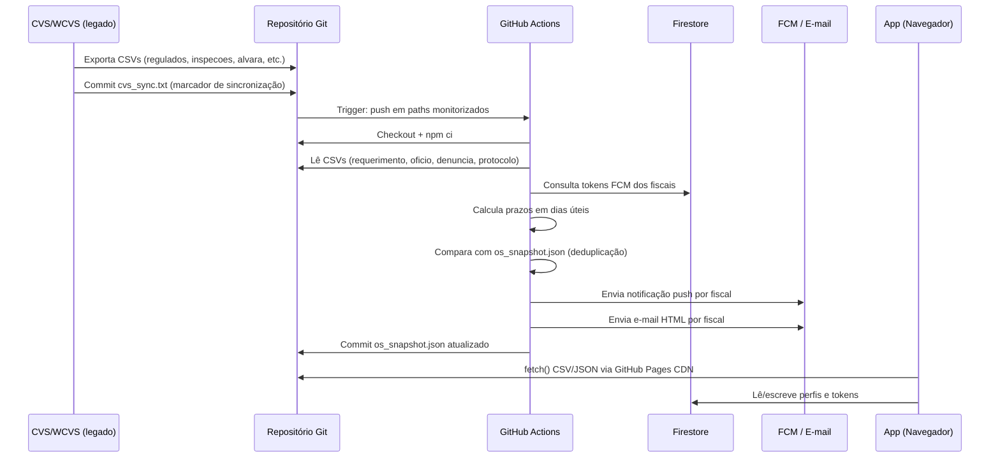
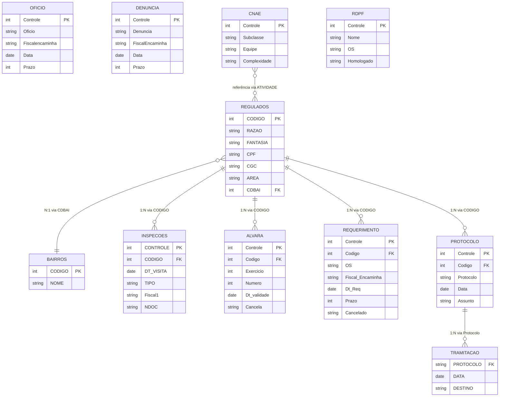
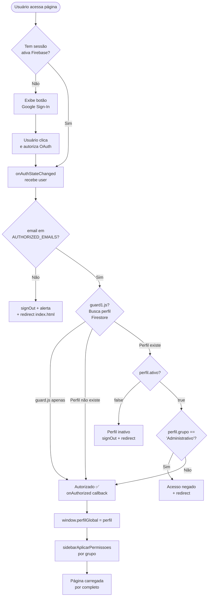
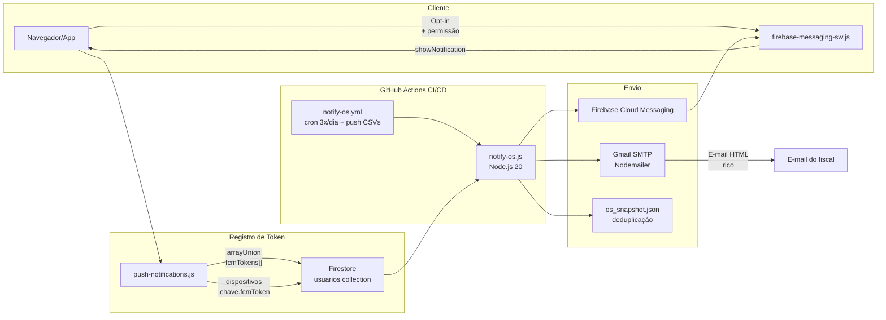
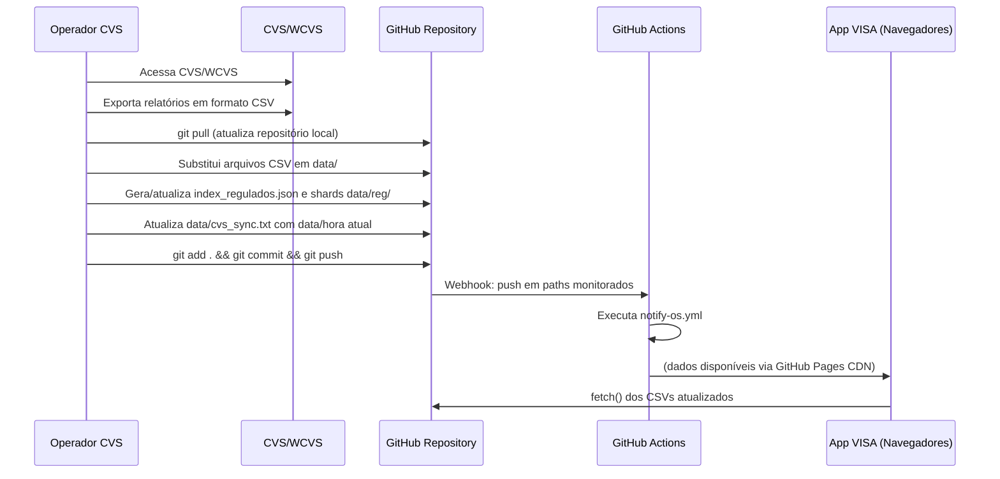

# Documentação Técnica do Sistema — VISA Anápolis

> **Classificação:** Uso Interno — Vigilância Sanitária Municipal de Anápolis-GO  
> **Versão do documento:** 1.0.0  
> **Versão do sistema documentado:** 2.5.3  
> **Data de elaboração:** março/2026  
> **Elaborado por:** Gerência de Sistemas — VISAM Anápolis

---

## Índice

1. [Identificação e Contexto Institucional](#1-identificação-e-contexto-institucional)
2. [Visão Geral da Arquitetura](#2-visão-geral-da-arquitetura)
3. [Modelo de Dados](#3-modelo-de-dados)
4. [Catálogo de Telas](#4-catálogo-de-telas)
5. [Regras de Negócio](#5-regras-de-negócio)
6. [Sistema de Autenticação e Autorização](#6-sistema-de-autenticação-e-autorização)
7. [Sistema de Notificações Push e E-mail](#7-sistema-de-notificações-push-e-e-mail)
8. [Integração com o CVS/WCVS](#8-integração-com-o-cvswcvs)
9. [CI/CD e Automação — GitHub Actions](#9-cicd-e-automação--github-actions)
10. [Progressive Web App — PWA e Service Workers](#10-progressive-web-app--pwa-e-service-workers)
11. [Checklists de Inspeção](#11-checklists-de-inspeção)
12. [Sistema de Design — Arquitetura CSS](#12-sistema-de-design--arquitetura-css)
13. [Busca Global Unificada](#13-busca-global-unificada)
14. [Glossário e Siglas](#14-glossário-e-siglas)
15. [Operação e Continuidade](#15-operação-e-continuidade)

---

## 1. Identificação e Contexto Institucional

### 1.1 Identificação do Sistema

| Atributo | Valor |
|---|---|
| **Nome completo** | VISA — Sistema de Informações da Vigilância Sanitária de Anápolis |
| **Sigla** | VISA / VISAM |
| **Versão atual** | 2.5.3 |
| **URL de produção** | `https://garrado.github.io/VISA/` |
| **URL do repositório** | `https://github.com/garrado/VISA` |
| **Órgão proprietário** | Divisão de Vigilância Sanitária (DVS) — Secretaria Municipal de Saúde (SMS) — Prefeitura de Anápolis-GO |
| **Tipo de sistema** | Progressive Web App (PWA) — uso interno |
| **Público-alvo** | Servidores públicos da Vigilância Sanitária Municipal de Anápolis |
| **Ambiente de hospedagem** | GitHub Pages (estático, sem servidor de aplicação) |
| **Última sincronização CVS** | 16/03/2026 |

### 1.2 Finalidade Administrativa

O sistema VISA é uma interface de consulta e gestão administrativa interna, destinada exclusivamente aos servidores lotados na Divisão de Vigilância Sanitária Municipal de Anápolis-GO. Sua finalidade é centralizar o acesso às informações operacionais derivadas do sistema CVS (Controle de Vigilância Sanitária), além de fornecer ferramentas de gestão de fiscalização, escalas e indicadores de desempenho.

O sistema **não substitui** os documentos oficiais expedidos pelo CVS e não possui valor jurídico próprio. Sua natureza é estritamente instrumental, voltada ao apoio à gestão interna da vigilância.

### 1.3 Enquadramento Jurídico-Institucional

| Instrumento | Dispositivo | Aplicabilidade |
|---|---|---|
| Constituição Federal de 1988 | Art. 37, caput | Princípios da Administração Pública (legalidade, impessoalidade, moralidade, publicidade, eficiência) |
| Lei Federal 8.080/1990 | Art. 18, VI | Atribuições do município em vigilância sanitária |
| Lei Federal 6.437/1977 | — | Infrações e penalidades sanitárias — base para os tipos documentais registrados no sistema |
| Lei Federal 9.782/1999 | — | Define o Sistema Nacional de Vigilância Sanitária (SNVS) e a Anvisa |
| Lei Federal 13.709/2018 | — | Lei Geral de Proteção de Dados (LGPD) — governa o tratamento de dados pessoais no sistema |
| Lei Complementar Municipal 377/2018 | — | Código Sanitário Municipal de Anápolis — base legal para as atividades fiscalizatórias registradas |
| Lei Complementar Municipal 548/2023 | — | Define a distribuição de áreas de atuação entre os fiscais sanitários |
| Resolução TCM-GO | — | Transparência e controle de sistemas de informação municipais |

### 1.4 Responsáveis Técnicos e Institucionais

| Papel | Responsabilidade |
|---|---|
| Coordenação institucional | Divisão de Vigilância Sanitária (DVS) — SMS Anápolis |
| Administração do sistema | Usuário com perfil **Administrador** no Firestore |
| Manutenção do código-fonte | Desenvolvedor designado (acesso ao repositório GitHub) |
| Sincronização de dados (CVS→Git) | Operador do CVS que exporta os CSVs e realiza commit no repositório |
| Provedor de autenticação | Google Firebase Auth (Google LLC) |
| Provedor de banco de dados | Google Firestore (Google LLC) |
| Provedor de notificações push | Firebase Cloud Messaging / FCM (Google LLC) |
| Hospedagem estática | GitHub Pages (Microsoft Corporation) |
| Automação CI/CD | GitHub Actions (Microsoft Corporation) |

---

## 2. Visão Geral da Arquitetura

### 2.1 Diagrama de Camadas



### 2.2 Stack Tecnológico

#### 2.2.1 Frontend (Client-Side)

| Componente | Tecnologia | Versão | Observação |
|---|---|---|---|
| Linguagem de marcação | HTML5 | — | Semântico, sem frameworks de template |
| Estilização | CSS3 com Custom Properties | — | Sem preprocessadores (SASS/LESS) |
| Lógica de aplicação | Vanilla JavaScript ES6+ | — | Módulos ES nativos (`import/export`) |
| Parser de CSV | PapaParse | 5.4.1 | Via CDN, streaming + download |
| Tabelas interativas | jQuery DataTables | 1.13.7 | Residual em páginas específicas |
| Exportação Excel | SheetJS (xlsx) | 0.18.5 | Via CDN |
| Exportação PDF | jsPDF + autoTable | — | Via CDN |
| Exportação Word | docx.js | — | Via CDN |
| Gráficos | Chart.js | 4.4.0 | Via CDN |
| Firebase SDK (cliente) | Firebase JS SDK modular | 10.12.0 | Via gstatic.com CDN |

#### 2.2.2 Backend-as-a-Service (Firebase)

| Serviço | Uso |
|---|---|
| Firebase Authentication | Login Google OAuth 2.0 — autenticação de todos os usuários |
| Cloud Firestore | Banco de dados NoSQL — perfis de usuário, tokens FCM, dispositivos |
| Firebase Cloud Messaging (FCM) | Notificações push para dispositivos registrados |

**Projeto Firebase:** `visam-3a30b`  
**Project ID:** `visam-3a30b`  
**Sender ID:** `308899251430`  
**App ID:** `1:308899251430:web:0053cdbd0bed7f0de76727`

#### 2.2.3 Automação e CI/CD

| Componente | Tecnologia | Versão |
|---|---|---|
| Runtime | Node.js | 20 (LTS) |
| Firebase Admin SDK | firebase-admin | ^13.6.1 (raiz) / ^12.0.0 (scripts) |
| Envio de e-mail | Nodemailer | ^6.9.0 |
| Plataforma CI/CD | GitHub Actions | ubuntu-latest |
| Hospedagem | GitHub Pages | — |

#### 2.2.4 Dependências de Build

O sistema **não possui etapa de build**. Todo o código é servido diretamente pelo GitHub Pages sem transpilação, bundling ou minificação. O deploy é realizado através de `git push` para a branch principal.

### 2.3 Fluxo de Dados: CVS → GitHub → App



---

## 3. Modelo de Dados

### 3.1 Arquivos CSV — Origem CVS/WCVS

O sistema utiliza 13 arquivos CSV como fonte primária de dados operacionais. Todos estão localizados no diretório `data/` do repositório e são servidos via GitHub Pages. O separador padrão é **ponto e vírgula (`;`)**.

A atualização destes arquivos é **manual**: o operador responsável pelo CVS exporta os dados e realiza commit no repositório Git. A única exceção é o arquivo `os_snapshot.json`, que é atualizado automaticamente pelo workflow de notificações.

---

#### 3.1.1 `regulados.csv` — Cadastro de Estabelecimentos Regulados

**Propósito:** Cadastro mestre de todos os estabelecimentos sujeitos à vigilância sanitária no município de Anápolis-GO.  
**Tamanho estimado:** ~7,9 MB  
**Frequência de atualização:** Síncrono com exportações do CVS  
**Chave primária:** `CODIGO`

| Campo | Tipo | Descrição | Observações |
|---|---|---|---|
| `CONTROLE` | Inteiro | Sequencial interno do CVS | Pode divergir de CODIGO |
| `CODIGO` | Inteiro | **Chave primária** do regulado | Usado como FK em todas as outras tabelas |
| `PESSOA` | Char(1) | Tipo de pessoa: `F`=Física, `J`=Jurídica | |
| `CPF` | String | CPF do titular (pessoa física) | Pode estar em branco |
| `CGC` | String | CNPJ da empresa (pessoa jurídica) | Pode estar em branco |
| `AGREGADO` | String | Código de vínculo a estabelecimento agregador | |
| `RAZAO` | String | Razão social ou nome do titular | |
| `FANTASIA` | String | Nome fantasia | Pode ser idêntico à razão social |
| `REPRESENTANTE` | String | Nome do responsável técnico/legal | |
| `REPRESENTANTE2` | String | Nome do segundo representante | |
| `CPFREPRES` | String | CPF do representante | |
| `CPFREPRES2` | String | CPF do segundo representante | |
| `ATIVIDADE` | String | Lista de subclasses CNAE em texto livre | Referência: `cnae.csv` |
| `HORARIO` | String | Horário de funcionamento declarado | |
| `AREA` | String | Sigla da área de atuação (AG, CS, DR, etc.) | Referência: `bairros.csv` |
| `GRUPO` | String | Grupo de risco sanitário | |
| `MUNICIPAL` | String | Indicador de alvará municipal | |
| `LOGRADOURO` | String | Endereço — logradouro e número | |
| `COMPLEMENT` | String | Endereço — complemento | |
| `BAIRRO` | String | Nome do bairro (texto livre) | |
| `CDBAI` | Inteiro | **FK** → `bairros.CODIGO` | Código numérico do bairro |
| `ZONA` | String | Zona urbana | |
| `CEP` | String | CEP | |
| `FONE` | String | Telefone fixo | |
| `CELULAR` | String | Telefone celular | |
| `EMAIL` | String | E-mail do estabelecimento | |
| `TAXA` | String | Classificação de taxa de fiscalização | |
| `INATIVIDADE` | String/Data | Data de inativação ou indicador | Vazio = ativo |
| `OBS` | String | Observações gerais | |
| `Pendoc` | String | Pendências documentais | |
| `Dt_cadastro` | Data (DD.MM.AAAA) | Data de cadastro no CVS | |
| `User` | String | Usuário CVS que cadastrou | |
| `Dt_alter` | Data (DD.MM.AAAA) | Data da última alteração | |
| `H_alter` | String | Hora da última alteração | |

---

#### 3.1.2 `inspecoes.csv` — Registro de Inspeções Sanitárias

**Propósito:** Histórico completo de todas as visitas e ações fiscais realizadas nos estabelecimentos regulados.  
**Tamanho estimado:** ~19 MB (maior arquivo do sistema)  
**Frequência de atualização:** Alta — registros diários  
**Chave primária:** `CONTROLE`

| Campo | Tipo | Descrição | Observações |
|---|---|---|---|
| `CONTROLE` | Inteiro | **Chave primária** sequencial | |
| `CODIGO` | Inteiro | **FK** → `regulados.CODIGO` | |
| `DT_VISITA` | Data (DD.MM.AAAA) | Data de realização da inspeção | |
| `PZ_RETORNO` | Inteiro | Prazo de retorno em dias | |
| `PRIORIDADE` | String | Prioridade da inspeção | |
| `ACAO` | String | Ação fiscal realizada (ex.: `INSPEÇÃO SANITÁRIA`) | |
| `TIPO` | String | Tipo de documento emitido (ex.: `TERMO DE INTIMAÇÃO`, `AUTO DE INFRAÇÃO`) | |
| `Modalidade` | String | Modalidade de atendimento | |
| `Denuncia` | String | Número da denúncia vinculada | FK lógica → `denuncia.csv` |
| `OS` | String | Número da OS vinculada | |
| `Oficio` | String | Número do ofício vinculado | FK lógica → `oficio.csv` |
| `Protocolo` | String | Número do protocolo vinculado | FK lógica → `protocolo.csv` |
| `NUMERO` | String | Número do documento emitido | |
| `NDOC` | Inteiro | Número de controle do documento físico | Usado como índice em `data/his/` |
| `Atividade` | String | CNAE da atividade inspecionada | |
| `Area` | String | Sigla da área de atuação | |
| `Libera` | String | Indicador de liberação | |
| `Fiscal1` | String | Nome do fiscal responsável (primário) | |
| `Fiscal2` | String | Nome do fiscal responsável (secundário) | |
| `Fiscal3` | String | Nome do fiscal responsável (terciário) | |
| `Meio` | String | Meio de atendimento (presencial, eletrônico, etc.) | |
| `Us_inclu` | String | Usuário CVS que incluiu o registro | |
| `Dt_inclu` | Data | Data de inclusão | |
| `Gr_inclu` | String | Grupo do usuário que incluiu | |
| `Us_altera` | String | Usuário CVS que alterou | |
| `Dt_altera` | Data | Data da última alteração | |
| `Entrega` | String | Data/indicador de entrega do documento | |

---

#### 3.1.3 `alvara.csv` — Alvarás Sanitários Emitidos

**Propósito:** Registro de todos os alvarás sanitários emitidos, com histórico de validade e cancelamentos.  
**Tamanho estimado:** ~8,2 MB  
**Frequência de atualização:** Síncrono com emissão de alvarás no CVS  
**Chave primária:** `Controle`

| Campo | Tipo | Descrição | Observações |
|---|---|---|---|
| `Controle` | Inteiro | **Chave primária** | |
| `Codigo` | Inteiro | **FK** → `regulados.CODIGO` | |
| `Exercicio` | Inteiro | Ano de exercício do alvará | |
| `Evento` | String | Tipo de evento gerador | |
| `Tipo` | String | Tipo de alvará | |
| `Unidade` | String | Unidade emissora (ex.: `Geral`) | |
| `Numero` | Inteiro | Número sequencial do alvará | |
| `Alteracao` | String | Indicador de alteração | |
| `Dt_altera` | Data | Data de alteração | |
| `Status` | String | Status atual (derivado; calculado na tela) | |
| `Libera` | String | Liberação de atividades vinculadas | |
| `Dt_libera` | Data | Data de liberação | |
| `Autoridade` | String | Autoridade sanitária que assinou | |
| `Dt_emite` | Data (DD.MM.AAAA) | Data de emissão | |
| `Dt_validade` | Data (DD.MM.AAAA) | Data de validade | Comparada com data atual para status |
| `Emitente` | String | Nome do emitente | |
| `Dt_reemite` | Data | Data de reemissão | |
| `Reemitente` | String | Nome do reemitente | |
| `Autenticador` | String | Autenticador digital | |
| `Cancela` | String | Indicador de cancelamento (`True`/`False`/vazio) | |
| `Cancelador` | String | Nome de quem cancelou | |
| `Dt_cancela` | Data | Data de cancelamento | |
| `Obs` | String | Observações | |
| `Duam` | String | Número do DUAM (Documento Único de Arrecadação Municipal) | |
| `Dt_duam` | Data | Data do DUAM | |
| `Requerente` | String | Nome do requerente | |
| `Ob_duam` | String | Observações do DUAM | |

**Regra de derivação de status (aplicada no frontend):**
- `Cancelado` → campo `Cancela` = `True`
- `Válido` → `Cancela` ≠ `True` AND `Dt_validade` ≥ data atual
- `Expirado` → `Cancela` ≠ `True` AND `Dt_validade` < data atual

---

#### 3.1.4 `requerimento.csv` — Ordens de Serviço por Requerimento

**Propósito:** Registra as OS abertas por requerimento de estabelecimento (pedido de renovação de alvará, abertura, etc.).  
**Tamanho estimado:** ~3 MB  
**Frequência de atualização:** Alta — principal fonte de OS do sistema  
**Chave primária:** `Controle`  
**Monitorado pelo CI/CD:** Sim (dispara workflow de notificação)

| Campo | Tipo | Descrição | Observações |
|---|---|---|---|
| `Controle` | Inteiro | **Chave primária** | |
| `Codigo` | Inteiro | **FK** → `regulados.CODIGO` | |
| `OS` | String | Número da Ordem de Serviço (ex.: `20210027`) | |
| `Area` | String | Sigla da área de atuação | |
| `Motivo` | String | Motivo do requerimento (Renovação, Abertura, etc.) | |
| `Prioridade` | String | Prioridade de atendimento | |
| `Veiculos` | String | Veículo alocado para a OS | |
| `Requerente` | String | Nome do requerente | |
| `Complexidade` | String | Complexidade da OS | |
| `Obs_Req` | String | Observações do requerimento | |
| `Dt_Req` | Data (DD.MM.AAAA) | Data de abertura do requerimento | |
| `Prazo` | Inteiro | Prazo em dias úteis | Vazio = usa 15 dias (padrão protocolo) |
| `Fiscal_Encaminha` | String | Nome do fiscal responsável | |
| `Fiscal_Sugere` | String | Fiscal sugerido | |
| `Recebedor` | String | Quem recebeu o requerimento | |
| `Dt_encaminha` | Data | Data de encaminhamento ao fiscal | |
| `Encaminhamento` | String | Texto de encaminhamento | |
| `Encaminhador` | String | Quem encaminhou | |
| `Justificativa` | String | Justificativa de encaminhamento | |
| `Atendimento` | String | Indicador de atendimento (`True`/`False`) | |
| `Fiscal_Atend` | String | Fiscal que atendeu | |
| `Dt_Atend` | Data | Data de atendimento | |
| `Tipo_Documento` | String | Tipo do documento gerado no atendimento | |
| `Num_Documento` | String | Número do documento gerado | |
| `Obs_Atend` | String | Observações do atendimento | |
| `Cancelado` | String | Indicador de cancelamento (`True`/`False`) | |

---

#### 3.1.5 `oficio.csv` — Ordens de Serviço por Ofício

**Propósito:** OS abertas por ofício de órgãos externos, solicitações de terceiros ou busca ativa.  
**Chave primária:** `Controle`  
**Monitorado pelo CI/CD:** Sim

| Campo | Tipo | Descrição |
|---|---|---|
| `Controle` | Inteiro | **Chave primária** |
| `Oficio` | String | Número do ofício (ex.: `20240008`) |
| `Origem` | String | Órgão de origem do ofício |
| `Data` | Data (DD.MM.AAAA) | Data de abertura |
| `Emitente` | String | Emitente do ofício |
| `Motivo` | String | Motivo (ex.: `SOLICITAÇÃO ÓRGÃOS EXTERNOS`, `BUSCA ATIVA`) |
| `Regulado` | String | Nome/razão do estabelecimento regulado |
| `Fantasia` | String | Nome fantasia |
| `Logradouro` | String | Endereço |
| `Cdbai` | Inteiro | **FK** → `bairros.CODIGO` |
| `Ordem` | String | Número de ordem interno |
| `Cpf` | String | CPF do titular |
| `Cnpj` | String | CNPJ do estabelecimento |
| `Fiscalencaminha` | String | Fiscal responsável |
| `Dtencaminha` | Data | Data de encaminhamento |
| `Prazo` | Inteiro | Prazo em dias úteis |
| `Terceiro` | String | Terceiro envolvido |
| `Dtatendimento` | Data | Data de atendimento |
| `Cancela` | String | Indicador de cancelamento |
| `Archive` | String | Indicador de arquivamento |
| `User` | String | Usuário CVS responsável |

---

#### 3.1.6 `denuncia.csv` — Ordens de Serviço por Denúncia

**Propósito:** OS originadas de denúncias de cidadãos registradas na VISA.  
**Chave primária:** `Controle`  
**Monitorado pelo CI/CD:** Sim

| Campo | Tipo | Descrição |
|---|---|---|
| `Controle` | Inteiro | **Chave primária** |
| `Denuncia` | String | Número da denúncia (ex.: `20210002`) |
| `Data` | Data | Data de registro |
| `Prazo` | Inteiro | Prazo em dias úteis |
| `Reclamado` | String | Nome do estabelecimento denunciado |
| `Logradouro` | String | Endereço do denunciado |
| `Cdbai` | Inteiro | **FK** → `bairros.CODIGO` |
| `Referencia` | String | Ponto de referência |
| `Ponto` | String | Ponto geográfico |
| `Area` | String | Área de atuação |
| `Objeto1` | String | Objeto da denúncia |
| `Satatus` | String | Status da denúncia (campo com typo no CVS) |
| `SINAVISA` | String | Código no sistema SINAVISA |
| `Descricao` | String | Descrição detalhada |
| `Cpf` | String | CPF do denunciado |
| `Cnpj` | String | CNPJ do denunciado |
| `Archive` | String | Indicador de arquivamento |
| `User` | String | Usuário CVS que registrou |
| `Meio` | String | Canal de recebimento da denúncia |
| `Emissao` | String | Número de emissão |
| `DtEmite` | Data | Data de emissão |
| `DtEncaminha` | Data | Data de encaminhamento ao fiscal |
| `FiscalEncaminha` | String | Fiscal responsável |
| `FiscalAtend` | String | Fiscal que atendeu |

---

#### 3.1.7 `protocolo.csv` — Protocolos Administrativos

**Propósito:** Registro de protocolos de entrada de documentos na VISA (projetos arquitetônicos, solicitações diversas).  
**Chave primária:** `Controle`  
**Monitorado pelo CI/CD:** Sim

| Campo | Tipo | Descrição |
|---|---|---|
| `Controle` | Inteiro | **Chave primária** |
| `Codigo` | Inteiro | **FK** → `regulados.CODIGO` |
| `Protocolo` | String | Número do protocolo (ex.: `20220015`) |
| `Data` | Data (DD.MM.AAAA) | Data de protocolo |
| `Hora` | String | Hora do protocolo |
| `Protocolante` | String | Nome de quem protocolou |
| `Documento` | String | Tipo do documento protocolado |
| `Email` | String | E-mail do protocolante |
| `Celular` | String | Celular do protocolante |
| `Assunto` | String | Assunto do protocolo |
| `Complemento` | String | Complemento do assunto |
| `Observa` | String | Observações |
| `Ecarregado` | String | Encarregado responsável |
| `Carga` | String | Carga de trabalho associada |
| `Usuario` | String | Usuário CVS que registrou |

---

#### 3.1.8 `tramitacao.csv` — Tramitação de Protocolos

**Propósito:** Registra o histórico de tramitação dos protocolos entre setores e fiscais.  
**Chave primária:** Composta (`PROTOCOLO` + `DATA` + `HORA`)  
**Relação:** N→1 com `protocolo.csv` via `PROTOCOLO` = `protocolo.Protocolo`

| Campo | Tipo | Descrição |
|---|---|---|
| `PROTOCOLO` | String | **FK** → `protocolo.Protocolo` |
| `DATA` | Data (DD.MM.AAAA) | Data da tramitação |
| `HORA` | String (HH:MM:SS AM/PM) | Hora da tramitação |
| `DESTINO` | String | Setor ou fiscal de destino |

---

#### 3.1.9 `cnae.csv` — Classificação Nacional de Atividades Econômicas

**Propósito:** Tabela de referência das atividades econômicas sujeitas à vigilância sanitária, com equipe responsável e complexidade.  
**Chave primária:** `Controle`

| Campo | Tipo | Descrição | Domínio |
|---|---|---|---|
| `Controle` | Inteiro | **Chave primária** | |
| `Subclasse` | String | Código CNAE subclasse (ex.: `5611-2/01`) | |
| `Classe` | Inteiro | Código CNAE classe numérico (ex.: `5611201`) | |
| `Atividade` | String | Descrição da atividade econômica | |
| `Equipe` | String | Sigla da equipe responsável | `AG`, `CS`, `DR`, `ED`, `HI`, `MD`, `OD`, `OS`, `AO`, `SS`, `TR`, `VT`, `BI`, `LP`, `AM` |
| `Complexidade` | String | Nível de complexidade sanitária | `ALTA`, `MÉDIA`, `BAIXA` |

---

#### 3.1.10 `bairros.csv` — Bairros e Distribuição por Área Fiscal

**Propósito:** Cadastro de bairros/locais do município com a distribuição dos fiscais responsáveis por área de atuação. Cada coluna de sigla de área contém o nome do fiscal responsável pelo atendimento naquele bairro.  
**Chave primária:** `CONTROLE` / `CODIGO`

| Campo | Tipo | Descrição |
|---|---|---|
| `CONTROLE` | Inteiro | Sequencial interno |
| `CODIGO` | Inteiro | **Chave primária** — referenciada em `regulados.CDBAI` |
| `NOME` | String | Nome do bairro ou localidade especial |
| `SETOR` | String | Setor urbano |
| `SETORALIMENTO` | String | Setor de alimentos |
| `IA` | String | Fiscal da área Indústria de Alimentos |
| `AG` | String | Fiscal da área Alimentação Geral |
| `ED` | String | Fiscal da área Ensino/Educação |
| `OS` | String | Fiscal da área Outros Serviços de Saúde |
| `SS` | String | Fiscal da área Serviços de Saúde |
| `OD` | String | Fiscal da área Odontologia |
| `CS` | String | Fiscal da área Cosméticos/Saneantes |
| `AM` | String | Fiscal da área Armazéns/Mercados |
| `VT` | String | Fiscal da área Veterinária |
| `BI` | String | Fiscal da área Beleza/Imagem |
| `LP` | String | Fiscal da área Lavanderias/Prestação de Serviços |
| `AO` | String | Fiscal da área Acupuntura/Outros |
| `TR` | String | Fiscal da área Transporte |
| `FU` | String | Fiscal da área Funerárias |
| `DR` | String | Fiscal da área Drogarias/Farmácias |
| `MD` | String | Fiscal da área Medicamentos |

---

#### 3.1.11 `rdpf.csv` — Relatório de Produção Fiscal (RDPF)

**Propósito:** Base de dados do Relatório de Produção Fiscal — registra cada ação realizada por fiscal, com vínculo às OSs, estabelecimentos, documentos e homologação gerencial.  
**Chave primária:** `Controle`

| Campo | Tipo | Descrição |
|---|---|---|
| `Controle` | Inteiro | **Chave primária** |
| `Tipo` | Char(1) | Tipo de registro: `S`=Serviço, `O`=OS, `P`=Plantão |
| `Nome` | String | Nome do fiscal |
| `Data` | Data (DD.MM.AAAA) | Data da ação |
| `OS` | String | Número da OS vinculada |
| `TIPOOS` | String | Tipo de OS (Requerimento, De Ofício, Denúncia, Protocolo) |
| `Motivo` | String | Motivo da OS |
| `Data_os` | Data | Data de abertura da OS |
| `Prazo` | Inteiro | Prazo em dias úteis |
| `Acao` | String | Ação realizada |
| `Doc` | String | Tipo de documento emitido |
| `Ndoc` | String | Número do documento |
| `Estabe` | String | Nome do estabelecimento atendido |
| `Meio` | String | Meio de atendimento |
| `Mod` | String | Modalidade |
| `Cnae` | String | CNAE da atividade |
| `Complex` | String | Complexidade |
| `Area` | String | Área de atuação |
| `Dupla` | String | Indica dupla fiscal (sim/não) |
| `Ponto` | String | Ponto de fiscalização |
| `Negativo` | String | Resultado negativo |
| `Entrega` | Data | Data de entrega do documento |
| `Comply` | String | Indicador de conformidade |
| `Homologado` | String | Indicador de homologação pelo gestor |
| `User_homoloda` | String | Usuário que homologou |
| `Data_homologa` | Data | Data de homologação |
| `Usuario` | String | Usuário CVS responsável |
| `Data_altera` | Data | Data de última alteração |
| `Fecha` | String | Indicador de fechamento |
| `Data_fecha` | Data | Data de fechamento |
| `Usr_fecha` | String | Usuário que fechou |

---

#### 3.1.12 `alvlib.csv` — Alvarás Liberados

**Propósito:** Complementa `alvara.csv` com dados de liberação de atividades específicas dos alvarás.  
**Uso:** Carregado em conjunto com `alvara.csv` na tela `alvara.html` para detalhar as atividades liberadas em cada alvará.

---

#### 3.1.13 `login.csv` — Histórico de Acesso

**Propósito:** Registro de acessos ao sistema CVS. Utilizado para auditoria interna.

---

### 3.2 Banco de Dados Firestore (NoSQL)

**Projeto:** `visam-3a30b`  
**Coleção principal:** `usuarios`  
**Chave do documento:** e-mail do usuário (normalizado: minúsculo, sem espaços)

#### 3.2.1 Schema do documento `usuarios/{email}`

```json
{
  "nome": "string — nome completo do servidor",
  "email": "string — e-mail Google (= ID do documento)",
  "ativo": "boolean — true = acesso permitido; false = bloqueado",
  "grupo": "string — Fiscal | Administrador | Administrativo",
  "notificationOptIn": "boolean — consentiu receber notificações push",
  "ultimoAcesso": "Timestamp — data/hora do último acesso registrado",
  "appVersion": "string — versão do app no último acesso (ex.: '2.5.3')",
  "observacoes": "string — notas do administrador sobre o usuário",
  "fcmTokens": ["string — array de tokens FCM de todos os dispositivos registrados"],
  "dispositivos": {
    "<SO>_<Navegador>_<Fabricante>_<Modelo>": {
      "sistemaOperacional": "string",
      "navegador": "string",
      "fabricante": "string",
      "modelo": "string",
      "resolucao": "string — ex.: '1920x1080'",
      "ultimoAcesso": "Timestamp",
      "fcmToken": "string — token FCM deste dispositivo específico",
      "appVersion": "string — versão do app neste dispositivo"
    }
  }
}
```

**Regras sobre o documento:**
- O ID do documento é o e-mail do usuário, normalizado (minúsculo, sem espaços)
- O documento é criado na primeira autenticação autorizada, caso não exista
- O campo `dispositivos` usa chave composta: `SO_Navegador_Fabricante_Modelo` — gerada pelo `platform-detector.js`
- Os tokens FCM são armazenados **atomicamente** em dois lugares: no array `fcmTokens[]` (para consulta rápida pelo CI/CD) e no objeto `dispositivos.<chave>.fcmToken` (para rastreabilidade por dispositivo)
- Tokens inválidos (rejeitados pelo FCM) são automaticamente removidos pelo script `notify-os.js`

#### 3.2.2 Grupos de Acesso no Firestore

| Grupo | Acesso | Restrições |
|---|---|---|
| `Fiscal` | Páginas operacionais | Vê apenas seus próprios dados em `inspecoes.html` e `rmpf.html` |
| `Administrador` | Acesso total | Acessa `admin.html`, `indicadores.html` e todos os dados de todos os fiscais |
| `Administrativo` | Bloqueado | Usuários do grupo administrativo não têm acesso a nenhuma página protegida por `guard1.js` |

---

### 3.3 JSONs de Regulados (Sharding)

Para otimizar a performance do carregamento, os dados detalhados dos estabelecimentos regulados são armazenados em JSONs fragmentados (sharding), servidos diretamente pelo GitHub Pages.

#### 3.3.1 `data/index_regulados.json` — Índice de Busca

**Tamanho:** ~2,1 MB  
**Geração:** Script externo a partir de `regulados.csv`  
**Uso:** Carregado integralmente na inicialização de `cvs.html` e pelo motor de busca global

```json
{
  "meta": {
    "origem": "CVS",
    "gerado_em": "2026-03-16T18:00:22-03:00"
  },
  "dados": [
    {
      "codigo": 4,
      "razao": "MARCIO FLAVIO DOS SANTOS",
      "fantasia": "BRISA SORVETERIA",
      "documento": "23.730.770/0001-83"
    }
  ]
}
```

#### 3.3.2 `data/reg/{prefixo}/{codigo}.json` — Detalhe do Regulado

**Organização:** Sharding por prefixo de 2 dígitos do código (ex.: código `43001` → `data/reg/43/43001.json`)  
**Geração:** Script externo a partir de `regulados.csv` + `inspecoes.csv` + `alvara.csv` + `cnae.csv` + `bairros.csv`  
**Cobertura:** Prefixos `05` a `43`

```json
{
  "codigo": 43001,
  "razao": "G21 TRANSPORTE E LOGISTICA LTDA",
  "fantasia": "G21",
  "cnpj": "54.350.022/0002-91",
  "cpf": null,
  "endereco": {
    "logradouro": "AV PEDRO LUDOVICO",
    "complemento": "QD03 LT36 SL 02",
    "fone": "6916-1619",
    "celular": "(62)06108-1616"
  },
  "bairro": { "nome": "RESIDENCIAL MORUMBI" },
  "atividades": [
    {
      "subclasse": "4930-2/02",
      "tipo": "Principal",
      "atividade": "Transporte rodoviario de carga...",
      "equipe": "TR",
      "complexidade": "MÉDIA"
    }
  ],
  "alvara_ultimo": {
    "dt_validade": "2026-12-02",
    "exercicio": 2025
  },
  "inspecoes": [
    {
      "ndoc": 123304,
      "dt_visita": "2025-12-29",
      "tipo": "ANÁLISE DE PAS",
      "numer": "000001",
      "Fiscal1": "MARCIO HENRIQUE GOMES RODOVALHO",
      "Fiscal2": "EDSON ARANTES FARIA FILHO",
      "Fiscal3": null,
      "pz_retorno": 45
    }
  ]
}
```

#### 3.3.3 `data/his/{bucket}/{ndoc}.json` — Histórico de Inspeções por Documento

**Organização:** Sharding pelo sufixo de 2 dígitos do número do documento fiscal (`ndoc`)  
**Uso:** Carregado em `regulados1.js` para exibição do histórico completo de inspeções

#### 3.3.4 `data/os_snapshot.json` — Snapshot de Deduplicação de Notificações

**Propósito:** Persiste o estado das notificações já enviadas para evitar reenvio duplicado.  
**Atualização:** Automática — commitado pelo workflow `notify-os.yml` após cada execução.

```json
{
  "20210028": {
    "tipo": "Requerimento",
    "fiscal": "PEDRO HENRIQUE AIRES RIBEIRO",
    "motivo": "Renovação",
    "prazo": "",
    "dataReq": "2021-09-28",
    "razao": "MARCK DE SOUZA ARAUJO",
    "atendida": false,
    "cancelada": false,
    "notif_5d": false,
    "notif_recuperacao": false,
    "notif_amanha": false,
    "notif_hoje": false,
    "email_notif_5d": false,
    "email_notif_amanha": false,
    "email_notif_hoje": false
  }
}
```

As flags booleanas `notif_*` e `email_notif_*` são setadas como `true` após o envio da notificação correspondente, impedindo reenvio.

---

### 3.4 Diagrama de Relacionamentos (ERD)



---

## 4. Catálogo de Telas

### Convenções

- **Guard:** mecanismo de proteção de acesso utilizado
  - `guard.js`: whitelist de e-mails hardcoded
  - `guard1.js`: whitelist + perfil Firestore + verificação de grupo
  - `Nenhum`: página pública (sem autenticação)
- **Parâmetros URL:** aceitos via `?param=valor` para deep link / integração entre telas

---

### 4.1 `index.html` — Dashboard Principal

| Atributo | Valor |
|---|---|
| **URL** | `/VISA/` ou `/VISA/index.html` |
| **Título** | Vigilância Sanitária |
| **Acesso** | Autenticado (whitelist guard.js) |
| **Guard** | `guard.js` (inline na página) |
| **CSVs carregados** | `protocolo.csv`, `requerimento.csv`, `denuncia.csv`, `oficio.csv` |
| **JSONs carregados** | `index_regulados.json` (via busca global), `data/reg/` shards |

**Funcionalidades:**

1. **Autenticação Google** — Login via Google Sign-In. Após autenticação, verifica whitelist de ~50 e-mails. Usuário não autorizado é redirecionado após signOut.
2. **Busca Global Unificada** — Campo de busca que consulta 7 fontes de dados em paralelo (regulados, OS por tipo, alvarás, protocolos, inspeções). Exibe dropdown com até 5 resultados por categoria.
3. **Cards de OS por Fiscal** — Para cada fiscal com OS pendentes, exibe um card com contagem de OS por tipo (Requerimentos, Denúncias, Ofícios, Protocolos), com badges coloridos por status de prazo.
4. **Sincronização CVS** — Exibe a data da última sincronização CVS lida de `data/cvs_sync.txt`.
5. **Modal de Opt-in de Notificações** — Exibido na primeira sessão autenticada. Permite ao usuário optar por receber notificações push via FCM.
6. **Controle de Versão do Service Worker** — Detecta novas versões do Service Worker e força atualização do cache.
7. **Dark Mode** — Aplicado automaticamente via `prefers-color-scheme`.

**Badges de prazo nos cards:**
- Vermelho (`🔴`): OS com prazo vencido (dias restantes < 0)
- Amarelo (`⚠️`): OS com prazo a vencer em até 5 dias úteis
- Verde/neutro (`📅`): OS dentro do prazo

**Parâmetros URL:** Nenhum

---

### 4.2 `os.html` — Consulta de Ordens de Serviço

| Atributo | Valor |
|---|---|
| **URL** | `/VISA/os.html` |
| **Título** | Consulta de Ordens de Serviço - VISA Anápolis |
| **Acesso** | Autenticado |
| **Guard** | `guard.js` (inline) |
| **CSVs carregados** | `requerimento.csv`, `oficio.csv`, `denuncia.csv`, `protocolo.csv`, `tramitacao.csv`, `regulados.csv`, `bairros.csv`, `cnae.csv` |

**Funcionalidades:**

1. **Filtros:** Tipo de OS (Requerimento/Ofício/Denúncia/Protocolo), Fiscal, Número da OS, Data do Requerimento, Regulado (razão social/fantasia/CNPJ/CPF), Cancelado (sim/não/todos), Atendido (sim/não/todos).
2. **DataTable** com paginação, busca e ordenação (jQuery DataTables 1.13.7) no desktop; **cards** no mobile (≤768px).
3. **Cálculo de prazo em dias úteis:** Para OS do tipo Protocolo, o prazo é fixo em 15 dias úteis a partir da data de abertura. Para demais tipos, o prazo é lido do campo `Prazo` do CSV.
4. **Badges de prazo** por OS individual: Vencido / A vencer (≤5 dias) / Normal.
5. **Modal de detalhes:** Exibe todos os dados da OS: dados temporais, fiscal responsável, dados do estabelecimento (razão, fantasia, CNPJ/CPF, endereço), status de atendimento e cancelamento.
6. **Link Google Maps** no modal — abre rota de navegação até o endereço do regulado (`travelmode=driving`).
7. **Exportação XLSX** (SheetJS) de todas as OS filtradas.
8. **Cache-busting diário** — força recarregamento dos CSVs após o horário configurado em `HORARIO_ATUALIZACAO`.

**Parâmetros URL aceitos:**

| Parâmetro | Efeito |
|---|---|
| `?tipo=Requerimento` | Pré-filtra por tipo de OS |
| `?fiscal=NOME` | Pré-filtra por fiscal |
| `?q=TEXTO` | Pré-filtra por texto (regulado/número) |
| `?numero=OS` | Busca direto por número de OS |

---

### 4.3 `cvs.html` — Entidades Reguladas (CVS)

| Atributo | Valor |
|---|---|
| **URL** | `/VISA/cvs.html` |
| **Título** | Regulados |
| **Acesso** | Autenticado |
| **Guard** | `guard.js` (inline) |
| **JSONs carregados** | `index_regulados.json` (índice), `data/reg/{prefixo}/{codigo}.json` (detalhe) |

**Funcionalidades:**

1. **Busca:** Pesquisa por razão social, nome fantasia, CPF/CNPJ ou código. Mínimo de 3 caracteres. Busca normalizada (sem acentos, case-insensitive).
2. **Lista de resultados** com razão, fantasia e documento. Clique abre o painel de detalhes.
3. **Painel de detalhes** (carregamento lazy do JSON individual):
   - Dados cadastrais: código, documento (CNPJ/CPF), endereço, bairro, telefone/celular
   - Link Google Maps para o endereço
   - Último alvará: exercício e validade
   - Botão `📋 Atividades` — lista todas as atividades CNAE cadastradas com subclasse, equipe e complexidade
   - Botão `📝 Inspeções` — lista as últimas inspeções com data, tipo de documento, número e fiscal
4. **Modal de histórico/memo** com scroll iOS-safe para exibição de detalhes em mobile.

**Parâmetros URL:**

| Parâmetro | Efeito |
|---|---|
| `?codigo=123` | Abre diretamente o detalhe do regulado com aquele código |
| `?q=TEXTO` | Pré-preenche o campo de busca |

---

### 4.4 `inspecoes.html` — Relatório de Inspeções Sanitárias

| Atributo | Valor |
|---|---|
| **URL** | `/VISA/inspecoes.html` |
| **Título** | Relatório Inspeções por fiscal e período - VISA Anápolis |
| **Acesso** | Fiscal / Administrador |
| **Guard** | `guard1.js` (ES module import) |
| **CSVs carregados** | `inspecoes.csv`, `regulados.csv`, `cnae.csv` |

**Funcionalidades:**

1. **Controle de perfil por grupo:** Fiscal visualiza apenas seus próprios registros (comparação do nome no campo `Fiscal1/2/3` com `window.perfilGlobal.nome`). Administrador acessa todos os dados.
2. **Filtros:** Fiscal (lista dos 44 fiscais oficiais), Data Inicial/Final, Nº do Documento (`NDOC`), Regulado (razão social, fantasia, CNPJ/CPF).
3. **Estatísticas por tipo de documento** — cards com contagem de: Termos de Intimação, Autos de Infração, Análises de PAS, e outros tipos.
4. **DataTable** com ordenação por data decrescente. Coluna OS exibe número e modalidade formatados.
5. **Exportações disponíveis:** PDF (jsPDF + autoTable), Excel (SheetJS), Word (docx.js), HTML.
6. **Auto-busca por parâmetros URL.**

**Parâmetros URL:**

| Parâmetro | Efeito |
|---|---|
| `?q=TEXTO` | Pré-filtra por texto |
| `?data=DD.MM.AAAA` | Pré-filtra por data |
| `?numero=NDOC` | Busca por número do documento |

---

### 4.5 `alvara.html` — Alvarás Sanitários Emitidos

| Atributo | Valor |
|---|---|
| **URL** | `/VISA/alvara.html` |
| **Título** | Alvarás Emitidos - CVS Vigilância Sanitária |
| **Acesso** | Autenticado |
| **Guard** | `guard.js` (inline) |
| **CSVs carregados** | `alvara.csv`, `alvlib.csv`, `regulados.csv`, `bairros.csv`, `cnae.csv` |

**Funcionalidades:**

1. **Filtros:** Data Inicial/Final (de emissão), Número do Alvará, Regulado (razão social ou CPF/CNPJ).
2. **Tabela com paginação manual** (25/50/100 por página). Ordenação clicável por: Exercício, Nº Alvará, Dt. Emissão, Dt. Validade, Status, CNPJ/CPF, Razão Social.
3. **Badges de status:** `✅ Válido` / `⚠️ Expirado` / `❌ Cancelado` — calculados dinamicamente.
4. **Modal de detalhes:** Dados do alvará, dados do estabelecimento, tabela de atividades liberadas com CNAE, observações.
5. **Sticky primeira coluna** em mobile (scroll horizontal com posição fixa).
6. **Cache-busting** via função `forcarAtualizacao()`.

**Parâmetros URL:**

| Parâmetro | Efeito |
|---|---|
| `?q=TEXTO` | Pré-filtra por texto |
| `?numero=NUM` | Busca por número do alvará |

---

### 4.6 `comply.html` — Indicadores de Conformidade Sanitária

| Atributo | Valor |
|---|---|
| **URL** | `/VISA/comply.html` |
| **Título** | Indicadores de Conformidade – VISA Anápolis |
| **Acesso** | Fiscal / Administrador |
| **Guard** | `guard1.js` |
| **CSVs carregados** | `requerimento.csv`, `alvara.csv`, `inspecoes.csv` |

**Funcionalidades:**

1. **Filtros de período** (Data Inicial e Final) — padrão: ano corrente.
2. **Cálculo de 4 indicadores** por contribuinte único (`Codigo`):
   - **① Requerimentos:** Solicitações de Renovação/Abertura não canceladas no período
   - **② Fiscalizações:** Inspeções realizadas no período para os contribuintes de ①
   - **③ Em Conformidade (Alvarás Emitidos):** Alvarás emitidos no período para os contribuintes de ①
   - **④ Não Conforme:** Contribuintes que requereram (①), foram fiscalizados (②) mas não receberam alvará (③)
3. **4 stat cards** com contagem e percentuais (Azul: Req. / Laranja: Fisc. / Verde: Alvarás / Vermelho: Não Conforme).
4. **Gráfico de barras** (Chart.js 4.4.0) com tooltips exibindo percentual sobre requerimentos.
5. **Tabela analítica** com totais e percentuais.
6. **Exportação PDF completa** (jsPDF): header VISA, cards, tabela, gráfico convertido para imagem, metodologia.
7. **Exportação HTML** com CSS embutido.

---

### 4.7 `indicadores.html` — Indicadores de Desempenho Mensal

| Atributo | Valor |
|---|---|
| **URL** | `/VISA/indicadores.html` |
| **Título** | Indicadores – VISA Anápolis |
| **Acesso** | Administrador exclusivo |
| **Guard** | Firebase Auth inline (verificação de grupo no Firestore) |
| **CSVs carregados** | `inspecoes.csv` |

**Funcionalidades:**

1. **Lógica de período automático:** Se o dia atual < 15, exibe o mês anterior. Se dia ≥ 15 e já há dados do mês atual (dia ≥ 15), exibe o mês atual. Caso contrário, exibe o mês anterior.
2. **Indicadores em tabela:**
   - Inspeções totais e média por fiscal
   - Autos de Infração e taxa percentual
   - Fiscais Ativos no período
   - OS atendidas por tipo (Requerimento, Ofício, Denúncia, Protocolo) com total
   - Top 5 Tipos de Documentos emitidos com ícones automáticos
3. **Bloqueio para não-Administradores:** Exibe tela de "Acesso restrito 🔒".

---

### 4.8 `admin.html` — Painel Administrativo

| Atributo | Valor |
|---|---|
| **URL** | `/VISA/admin.html` |
| **Título** | Painel Administrativo - VISA Anápolis |
| **Acesso** | Administrador exclusivo |
| **Guard** | Firebase Auth inline + verificação Firestore |
| **Banco de dados** | Firestore — coleção `usuarios` |

**Funcionalidades:**

1. **Estatísticas gerais:** Total de usuários, Fiscais, Administradores, Administrativos, Ativos, Acessos (últimas 24h), Dispositivos com token push, Usuários com opt-in de notificação.
2. **Pills de versão por dispositivo:** Lista todas as versões do app em uso e destaca a mais recente em verde.
3. **Auditoria de consistência:** Compara a `AUTHORIZED_EMAILS` hardcoded no `index.html` com os documentos do Firestore. Detecta: IDs de documento diferentes do e-mail, usuários no Firestore sem autorização e e-mails autorizados sem perfil no Firestore.
4. **Tabela de usuários** (desktop) e **cards** (mobile): foto/avatar do Google, nome, e-mail, grupo, status, versão do app, opt-in de notificações, último acesso.
5. **Modal de edição de usuário:** Permite alterar nome, grupo (Fiscal/Administrador/Administrativo), status (Ativo/Inativo) e observações. Valida se o e-mail consta na `AUTHORIZED_EMAILS` antes de ativar.
6. **Modal de dispositivos:** Lista todos os dispositivos registrados por usuário (SO, navegador, resolução, modo de acesso, versão, token FCM, opt-in push).

---

### 4.9 `rmpf.html` — Relatório Mensal de Produção Fiscal

| Atributo | Valor |
|---|---|
| **URL** | `/VISA/rmpf.html` |
| **Título** | RMPF - Relatório de Produção Fiscal |
| **Acesso** | Fiscal / Administrador |
| **Guard** | `guard1.js` |
| **CSVs carregados** | `rdpf.csv` |

**Funcionalidades:**

1. **Controle de perfil:** Fiscal vê apenas seus próprios registros; Administrador acessa todos os fiscais.
2. **Filtros:** Fiscal (dropdown com 44 fiscais oficiais), Mês/Ano de referência.
3. **DataTable** com colunas: OS, Data, Prazo, Documento/Ação Fiscal, Nº, Regulado/Atividade, Complexidade, Anotações.
4. **Exportações disponíveis:** PDF (jsPDF), Excel (XLSX), Word (docx.js), HTML.

---

### 4.10 `protocolo.html` — Consulta de Protocolos

| Atributo | Valor |
|---|---|
| **URL** | `/VISA/protocolo.html` |
| **Título** | Consulta de Protocolos - VISA Anápolis |
| **Acesso** | Público (sem autenticação) |
| **Guard** | Nenhum |
| **CSVs carregados** | `regulados.csv`, `protocolo.csv`, `tramitacao.csv`, `bairros.csv` |

**Funcionalidades:**

1. **Busca** por número de protocolo (≥4 dígitos), razão social ou nome de fantasia. Limite de 50 resultados.
2. **Cards de resultado** com dados do estabelecimento (razão, fantasia, CNPJ/CPF, endereço) e tabela de protocolos vinculados.
3. **Tramitações:** Exibidas em accordion inline no mobile; em modal na desktop.
4. **Índices em memória:** `Map` de regulados por código, protocolos por regulado, tramitações por número de protocolo, bairros por código — para joins rápidos sem I/O adicional.

**Parâmetros URL:**

| Parâmetro | Efeito |
|---|---|
| `?q=TEXTO` | Pré-preenche a busca |

---

### 4.11 `plantao.html` — Escala de Plantão Fiscal

| Atributo | Valor |
|---|---|
| **URL** | `/VISA/plantao.html` |
| **Título** | Escala de Plantão Fiscal - VISA Anápolis |
| **Acesso** | Autenticado |
| **Guard** | Firebase Auth inline |
| **Dados** | Hardcoded em objeto `escalaPorMes` |

**Funcionalidades:**

1. **Filtros:** Mês/Ano, Fiscal, Data específica.
2. **Cálculo automático de feriados** — algoritmo Meeus/Jones/Butcher para cálculo autônomo da Páscoa, mais feriados nacionais fixos e pontos facultativos.
3. **Geração de PDF de Ordem de Serviço** (jsPDF) — restrito a Administradores. Inclui cabeçalho institucional, brasão, tabela em duas colunas e campo de assinatura.
4. **DataTable** desktop com primeira coluna sticky; **cards** mobile por dia.
5. **Totalização por fiscal** com DataTable e cards mobile.

---

### 4.12 `veiculos.html` — Escala de Uso de Veículos

| Atributo | Valor |
|---|---|
| **URL** | `/VISA/veiculos.html` |
| **Título** | Escala de Veículos - VISA Anápolis |
| **Acesso** | Autenticado |
| **Guard** | Firebase Auth inline |
| **Dados** | `escalaBaseSemanal` hardcoded + `ferias.html` (fetch para férias) |

**Funcionalidades:**

1. **Escala base semanal** (SEG-SEX, Matutino e Vespertino, Veículo 1 e 2).
2. **Afastamentos automáticos:** Busca a escala de férias via `fetch()` de `ferias.html` como fonte única. Se fiscal está de férias → exibe `VAGO`.
3. **Feriados municipais** de Anápolis e pontos facultativos além dos nacionais.
4. **Filtros:** Fiscal, Data, Turno, Veículo, Mês e Ano.
5. **DataTable** com agrupamento visual por data.

---

### 4.13 `ferias.html` — Escala de Férias

| Atributo | Valor |
|---|---|
| **URL** | `/VISA/ferias.html` |
| **Acesso** | Autenticado |
| **Dados** | Hardcoded em `dadosFerias[]` (32 registros, Jan-Abr/2026) |

**Funcionalidades:** Filtros por nome, data específica, mês e ano. DataTable com colunas Fiscal/Início/Fim. Lógica de interseção por data.

---

### 4.14 `areas.html` — Distribuição por Áreas Fiscais

| Atributo | Valor |
|---|---|
| **URL** | `/VISA/areas.html` |
| **Acesso** | Autenticado |
| **CSVs carregados** | `bairros.csv`, `cnae.csv` |

**Funcionalidades:**

1. **Tabela** com bairros nas linhas e áreas de atuação nas colunas, exibindo o fiscal responsável por área×bairro.
2. **Filtros:** Bairro/Local, Fiscal (destaque `.hit` amarelo ao encontrar), Área (sigla).
3. **Modal de CNAE:** Clique no cabeçalho da área abre lista das atividades econômicas da equipe.
4. **Modal Aviso Legal:** Informa que a distribuição não é fixa, com referência à LC 548/2023.
5. **15 áreas de atuação:** IA, AG, ED, OS, SS, OD, CS, AM, VT, BI, LP, AO, TR, DR, MD.

---

### 4.15 `cnae.html` — CNAEs por Equipe

| Atributo | Valor |
|---|---|
| **URL** | `/VISA/cnae.html` |
| **Acesso** | Autenticado |
| **CSVs carregados** | `cnae.csv` |

**Funcionalidades:** Tabelas por equipe de fiscalização listando todas as subclasses CNAE. Busca em tempo real filtra todas as tabelas simultaneamente. Equipes documentadas: AG, CS, DR, ED, HI, MD, OD, OS, PS, SS, TR, VT.

---

### 4.16 `simxcvs.html` — Comparativo SIM × CVS

| Atributo | Valor |
|---|---|
| **URL** | `/VISA/simxcvs.html` |
| **Acesso** | Autenticado |
| **JS** | `js/simxcvs.js` |

**Funcionalidades:** Compara CNAEs cadastrados no SIM (Cadastro Econômico Municipal) versus os cadastrados no CVS para o mesmo contribuinte. Interface de busca de regulados com painel de comparação lado a lado.

---

### 4.17 `total.html` — Totalização de Regulados por Área

| Atributo | Valor |
|---|---|
| **URL** | `/VISA/total.html` |
| **Acesso** | Autenticado (Desktop only — redireciona mobile) |
| **JSONs carregados** | `data/reg/` shards (todos os prefixos) |

**Funcionalidades:**

1. Processa todos os regulados classificados como "Alta Complexidade".
2. Totaliza por área com **prioridade de classificação:** Medicamentos > Produtos para Saúde > Saneantes > Serviços de Saúde > Indústrias Alimentícias.
3. **Barra de progresso** com concorrência configurável (6/10/16 fetches paralelos).
4. **Gráfico de barras** (Chart.js) e **exportação CSV**.

---

### 4.18 `check.html` — Checklists de Inspeção

| Atributo | Valor |
|---|---|
| **URL** | `/VISA/check.html` |
| **Acesso** | Autenticado |
| **Dados** | 9 PDFs locais em subdiretórios |

**Funcionalidades:** Lista de 9 checklists em cards. Modal fullscreen para visualização de PDF com `<object>` (compatível iOS/Android). Botões: Fechar, Abrir Externamente, Baixar PDF.

---

### 4.19 `legislacao.html` — Legislação Sanitária

| Atributo | Valor |
|---|---|
| **URL** | `/VISA/legislacao.html` |
| **Acesso** | Público |
| **Guard** | Nenhum |

**Funcionalidades:** Links organizados para legislação nacional (Leis 8.080/90, 6.437/77, 9.782/99), estadual (Lei 16.140/2007-GO) e municipal (LC 377/2018 — aberta localmente). Link para AnvisaLegis.

---

### 4.20 `pop.html` — Lista Mestra de POPs

| Atributo | Valor |
|---|---|
| **URL** | `/VISA/pop.html` |
| **Acesso** | Público |
| **Guard** | Nenhum |

**Funcionalidades:** Tabela de 18 POPs (GVS V.09) com código, título, revisão, vigência e status. Modal fullscreen com visualizador de PDF. Detecção automática de anexos (até 10 por POP via `HEAD` requests). Navegação entre POP principal e anexos.

---

### 4.21 `mts.html` — Mandado de Tarefas Sanitárias

| Atributo | Valor |
|---|---|
| **URL** | `/VISA/mts.html` |
| **Acesso** | Autenticado |
| **Dados** | `mts/MTS_GERAL_TODOS_FISCAIS.pdf` |

**Funcionalidades:** Exibe o PDF do MTS em iframe fullscreen. Botão para abrir em nova aba.

---

### 4.22 `relatorio_plantao_fiscal.html` — Registro de Ocorrências de Plantão

| Atributo | Valor |
|---|---|
| **URL** | `/VISA/relatorio_plantao_fiscal.html` |
| **Acesso** | Autenticado |

**Funcionalidades:** Formulário para registro de ocorrências de plantão: nome do fiscal, data, período (manhã/tarde/integral), atividades realizadas e observações. Impressão via `window.print()` com cabeçalho institucional (oculto na tela, visível na impressão).

---

### 4.23 `clean.html` — Manutenção de Dispositivos/FCM

| Atributo | Valor |
|---|---|
| **URL** | `/VISA/clean.html` |
| **Acesso** | Administrador exclusivo |
| **Guard** | Firebase Auth inline |
| **Banco de dados** | Firestore — coleção `usuarios` |

**Funcionalidades:**

1. **Migração de chaves de dispositivos** — reagrupa dispositivos pela chave composta `SO_Navegador_Fabricante_Modelo`, removendo duplicatas e mantendo `ultimoAcesso` mais recente.
2. **Associação de tokens órfãos** — vincula tokens `fcmTokens[]` não associados a dispositivos ao dispositivo mais recente.
3. **Modo dry-run** (simulação sem gravação) e modo real, com log em tempo real.

---

### 4.24 `readme.html` — Aviso Institucional

| Atributo | Valor |
|---|---|
| **URL** | `/VISA/readme.html` |
| **Acesso** | Público |

**Funcionalidades:** Documento jurídico-institucional com 13 seções cobrindo enquadramento legal, LGPD, limitações do sistema e contato institucional.

---

## 5. Regras de Negócio

Esta seção documenta as regras de negócio implementadas no sistema, identificadas por código único para rastreabilidade.

---

### RN-01 — Controle de Acesso por Whitelist de E-mails

**Escopo:** Todas as páginas que utilizam `guard.js`  
**Implementação:** `js/guard.js` → constante `AUTHORIZED_EMAILS` (Set de strings)

O acesso ao sistema é controlado por uma lista explícita (`whitelist`) de endereços de e-mail autorizados, hardcoded no código-fonte. A verificação ocorre após a autenticação Google OAuth 2.0.

**Fluxo:**
1. Usuário realiza login com conta Google
2. Firebase Auth devolve o objeto `user` com `user.email`
3. O e-mail é normalizado (minúsculo, sem espaços) via `normEmail()`
4. Verifica-se `AUTHORIZED_EMAILS.has(email)`
5. Se não autorizado: `signOut()` é chamado e o usuário é redirecionado para `index.html` com alerta

**Observação crítica:** A whitelist está replicada em pelo menos 3 arquivos: `js/guard.js`, `index.html` (inline) e `admin.html` (para auditoria). Alterações de autorização devem ser aplicadas em **todos** esses locais.

**E-mails autorizados:** ~50 endereços, incluindo domínios `@anapolis.go.gov.br` (servidores municipais) e domínios pessoais (`@gmail.com`, `@hotmail.com`) dos servidores.

---

### RN-02 — Controle de Sessão com Expiração Automática

**Escopo:** Todas as páginas protegidas por `guard.js` e `guard1.js`  
**Implementação:** `js/guard.js` e `js/guard1.js` — funções `setSessionMarks()`, `isSessionExpired()`, `startExpiryTimer()`

**Parâmetros:**
- Duração máxima da sessão: **8 horas** (480 minutos) a partir do primeiro login
- Timeout de inatividade: **20 minutos** sem interação do usuário

**Armazenamento:** `sessionStorage` — chaves `visa_session_start` e `visa_last_active` (timestamps em milissegundos)

**Eventos que renovam o timer de inatividade:** `mousemove`, `mousedown`, `keydown`, `touchstart`, `scroll`, `click`, `visibilitychange` (quando a aba volta ao foco)

**Verificação:** A cada 10 segundos, `setInterval` verifica se alguma das condições de expiração foi atingida. Se sim, `signOut()` é chamado, o `sessionStorage` é limpo e o usuário é redirecionado com alerta.

---

### RN-03 — Controle de Acesso por Grupo (Perfil Firestore)

**Escopo:** Páginas que utilizam `guard1.js`; sidebar em todas as páginas  
**Implementação:** `js/guard1.js` → `getDoc(doc(db, 'usuarios', email))`; `js/sidebar.js` → `sidebarAplicarPermissoes(grupo)`

**Grupos e permissões:**

| Grupo | Acesso a páginas `guard1.js` | Dados visíveis | Links na sidebar |
|---|---|---|---|
| `Fiscal` | ✅ Permitido | Apenas seus próprios dados (`inspecoes.html`, `rmpf.html`) | Todos exceto Admin/Indicadores |
| `Administrador` | ✅ Permitido | Dados de todos os fiscais | Todos os links |
| `Administrativo` | ❌ Bloqueado | — | Bloqueados os links restritos |

**Links restritos na sidebar por grupo:**
- Apenas Fiscal+Admin: `rmpf.html`, `inspecoes.html`, `comply.html`
- Apenas Admin: `admin.html`, `indicadores.html`

**Usuário inativo:** Se `perfil.ativo === false`, o acesso é bloqueado mesmo que o e-mail esteja na whitelist. Exibe alerta e faz `signOut()`.

---

### RN-04 — Cálculo de Prazo em Dias Úteis para OS

**Escopo:** `os.html`, `notify-os.js`  
**Implementação:** Função `adicionarDiasUteis(dataBase, dias)` em `notify-os.js`; lógica similar em `os.html`

**Regras de prazo por tipo de OS:**

| Tipo de OS | Prazo |
|---|---|
| Requerimento | Campo `Prazo` do `requerimento.csv` (em dias úteis) |
| Ofício | Campo `Prazo` do `oficio.csv` (em dias úteis) |
| Denúncia | Campo `Prazo` do `denuncia.csv` (em dias úteis) |
| Protocolo | **Fixo: 15 dias úteis** a partir de `Data` do `protocolo.csv` |

**Cálculo de dias úteis:** Sábados e domingos são excluídos. A versão do `notify-os.js` não calcula feriados para o prazo; os feriados são considerados apenas no contexto da escala de plantão e veículos (`plantao.html`, `veiculos.html`).

**Data-base:** Para Requerimento, é o campo `Dt_Req`. Para Ofício, `Data`. Para Denúncia, `Data`. Para Protocolo, `Data`.

---

### RN-05 — Classificação de Status de Prazo (Semáforo)

**Escopo:** `os.html`, `index.html` (cards de OS por fiscal)

| Status | Condição | Indicador Visual |
|---|---|---|
| Vencido | Dias restantes < 0 | 🔴 Badge vermelho |
| A vencer | 0 ≤ dias restantes ≤ 5 | ⚠️ Badge amarelo |
| Normal | Dias restantes > 5 | 📅 Badge neutro/verde |

**Observação:** OS com `Atendimento = True` ou `Cancelado = True` são excluídas do cálculo de prazo e não recebem badges de alerta.

---

### RN-06 — Restrição de Dados por Perfil em Relatórios

**Escopo:** `inspecoes.html`, `rmpf.html`  
**Implementação:** Comparação de `window.perfilGlobal.nome` com `Fiscal1`/`Fiscal2`/`Fiscal3` (inspecoes) ou `Nome` (rdpf)

**Regra:** Usuário do grupo `Fiscal` recebe os dados pré-filtrados para exibir apenas registros onde seu nome aparece como fiscal responsável. O dropdown de seleção de fiscal é ocultado ou fixado no seu próprio nome.

Usuário do grupo `Administrador` acessa todos os registros sem restrição de fiscal.

---

### RN-07 — Metodologia dos Indicadores de Conformidade

**Escopo:** `comply.html`  
**Implementação:** JavaScript inline na página

**Definições operacionais:**

| Indicador | Definição |
|---|---|
| **① Requerimentos** | Registros em `requerimento.csv` onde `Motivo` ∈ {Renovação, Abertura} AND `Cancelado` ≠ `True` AND `Dt_Req` ∈ período selecionado |
| **② Fiscalizações** | Registros em `inspecoes.csv` onde `CODIGO` ∈ conjunto de códigos de ① AND `DT_VISITA` ∈ período |
| **③ Em Conformidade** | Registros em `alvara.csv` onde `Codigo` ∈ conjunto de códigos de ① AND `Dt_emite` ∈ período AND `Cancela` ≠ `True` |
| **④ Não Conforme** | Regulados ∈ ① ∩ ② mas ∉ ③ |

**Correlação:** A chave de cruzamento é sempre o campo `CODIGO`/`Codigo` do regulado.

---

### RN-08 — Período Automático dos Indicadores Mensais

**Escopo:** `indicadores.html`

**Lógica de determinação do período:**
```
SE dia_atual < 15:
    exibir mês anterior (ex.: em 10/mar → exibir fevereiro)
SENÃO:
    SE já há dados do mês atual (dia ≥ 15) em inspecoes.csv:
        exibir mês atual
    SENÃO:
        exibir mês anterior
```

**Justificativa:** Os dados do mês corrente só são considerados completos após o dia 15, quando os fiscais já tiveram tempo de lançar suas inspeções no sistema.

---

### RN-09 — Derivação de Status de Alvará

**Escopo:** `alvara.html`  
**Implementação:** JavaScript inline na página

```
SE Cancela == 'True':
    status = 'Cancelado'    → badge ❌
SENÃO SE Dt_validade < data_atual:
    status = 'Expirado'     → badge ⚠️
SENÃO:
    status = 'Válido'       → badge ✅
```

O campo `Status` bruto do CSV não é utilizado diretamente. O status é sempre recalculado pelo frontend com base em `Dt_validade` e `Cancela`.

---

### RN-10 — Sistema de Notificações Push/E-mail — Gatilhos e Deduplicação

**Escopo:** `notify-os.js` (GitHub Actions)  
**Implementação:** Script Node.js executado via workflow CI/CD

**4 Gatilhos de notificação:**

| Gatilho | Condição | Flag no Snapshot |
|---|---|---|
| `VENCE_HOJE` | Dias restantes até o prazo = 0 | `notif_hoje` |
| `AMANHA` | Dias restantes = 1 | `notif_amanha` |
| `PRAZO_5D` | 2 ≤ Dias restantes ≤ 5 | `notif_5d` |
| `RECUPERACAO` | Prazo vencido (dias < 0) E OS não atendida E não cancelada | `notif_recuperacao` |

**Deduplicação:** Antes de enviar qualquer notificação, o script verifica se a flag correspondente no `os_snapshot.json` já está setada como `true`. Se sim, a notificação não é reenviada, mesmo que o workflow rode novamente.

**Escopo de OS notificáveis:** Apenas OS com `Atendimento ≠ True` E `Cancelado ≠ True`.

**Envio por fiscal:** As notificações são agrupadas por fiscal (campo `Fiscal_Encaminha`/`Fiscalencaminha`/`FiscalEncaminha`). Cada fiscal recebe uma notificação consolidada com todas as OSs que requerem atenção, não uma notificação por OS.

**Canais:** Firebase Cloud Messaging (push para dispositivos móveis/desktop) + Nodemailer/Gmail SMTP (e-mail HTML rico).

---

### RN-11 — Escala de Veículos com Afastamentos Automáticos

**Escopo:** `veiculos.html`

**Regra:** Ao carregar a escala de veículos, o sistema busca dinamicamente os dados de férias via `fetch()` de `ferias.html` (parse do HTML da página de férias). Se o fiscal alocado em determinado turno/dia está em período de férias, o slot exibe `VAGO`.

**Regra para dupla fiscal:** Se dois fiscais estão alocados juntos, o slot só exibe `VAGO` se **ambos** estiverem de férias. Se apenas um está de férias, o nome do fiscal disponível é exibido.

**Fonte única de verdade para férias:** `ferias.html` — alterações na escala de férias propagam-se automaticamente para a escala de veículos.

---

### RN-12 — Prioridade de Área na Totalização

**Escopo:** `total.html`

Quando um regulado está classificado em múltiplas áreas simultaneamente, a totalização atribui-o à área de maior prioridade:

| Prioridade | Área |
|---|---|
| 1ª (maior) | Medicamentos (MD) |
| 2ª | Produtos para Saúde (OS) |
| 3ª | Saneantes (CS) |
| 4ª | Serviços de Saúde (SS) |
| 5ª | Indústrias Alimentícias (IA) |
| Demais | Alimentação Geral (AG) e outras |

---

### RN-13 — Auditoria de Consistência da Whitelist

**Escopo:** `admin.html`

O painel administrativo executa uma auditoria automática de consistência entre duas fontes de autorização:

1. **Whitelist hardcoded** (`AUTHORIZED_EMAILS` no `index.html`)
2. **Perfis no Firestore** (coleção `usuarios`)

**Inconsistências detectadas:**
- **ID ≠ e-mail:** Documento no Firestore cujo ID (chave) diverge do campo `email` interno
- **Não autorizado:** Perfil no Firestore de e-mail que não consta na whitelist
- **Sem perfil:** E-mail na whitelist sem documento correspondente no Firestore (usuário nunca logou ou perfil excluído)

---

### RN-14 — Gestão Atômica de Tokens FCM

**Escopo:** `push-notifications.js`, `notify-os.js`

**Registro:** Ao obter um novo token FCM, o sistema realiza uma operação atômica no Firestore via `updateDoc` com `arrayUnion`, garantindo que:
1. O token é adicionado ao array `fcmTokens[]` do usuário
2. O token é associado ao dispositivo específico via `dispositivos.<chave>.fcmToken`

**Rotação de tokens:** O FCM pode invalidar tokens existentes e gerar novos. O sistema trata a rotação via callback `onTokenRefresh`, removendo o token antigo e registrando o novo.

**Limpeza de tokens inválidos:** Quando o FCM rejeita um envio (token expirado/inválido), o script `notify-os.js` remove automaticamente os tokens inválidos do Firestore via `_removerTokensInvalidos()`.

---

### RN-15 — Lista Oficial de 44 Fiscais

**Escopo:** `os.html`, `rmpf.html`, `notify-os.js` e outros

O sistema mantém uma lista canônica de **44 fiscais** da VISAM Anápolis, hardcoded em múltiplos arquivos. Esta lista é usada para:
- Popular dropdowns de filtro
- Associar OSs a fiscais por nome
- Endereçar notificações push/e-mail
- Calcular estatísticas por fiscal

**Implicação:** A adição ou remoção de fiscais requer atualização manual da lista em todos os arquivos que a contêm. Não existe uma fonte única de verdade para esta lista no sistema atual.

---

## 6. Sistema de Autenticação e Autorização

### 6.1 Visão Geral

O sistema utiliza **Google OAuth 2.0** via Firebase Authentication como único mecanismo de autenticação. Não existe cadastro de senha — todos os usuários fazem login com suas contas Google pessoais ou institucionais.

A **autorização** opera em duas camadas complementares:
1. **Whitelist de e-mails** (camada 1): controle binário — e-mail autorizado ou não
2. **Perfil no Firestore** (camada 2): controle granular por grupo e status ativo/inativo

### 6.2 Fluxo de Autenticação e Autorização



### 6.3 Guard.js vs Guard1.js — Comparativo

| Característica | `guard.js` | `guard1.js` |
|---|---|---|
| **Verificação** | Whitelist local (`Set`) | Whitelist + Firestore `getDoc` |
| **Controle de inativo** | Não | Sim — bloqueia se `ativo: false` |
| **Controle de grupo** | Não | Sim — bloqueia `Administrativo` |
| **`window.perfilGlobal`** | Não definido | Definido com dados do Firestore |
| **Dependência de rede** | Apenas Firebase Auth | Firebase Auth + Firestore |
| **Assinatura da função** | `protectPage({ firebaseConfig, onAuthorized })` | `protectPage(firebaseConfig, onAuthorized)` |
| **Páginas que utilizam** | `index.html`, `os.html`, `cvs.html`, `alvara.html`, `protocolo.html` | `inspecoes.html`, `rmpf.html`, `comply.html` |

### 6.4 Persistência de Sessão

A persistência é configurada como `browserLocalPersistence` via Firebase Auth, o que significa que a sessão persiste entre fechamentos do navegador (stored em `localStorage`). O controle de expiração é gerenciado pelo próprio sistema (RN-02), não pelo Firebase.

### 6.5 Tabela de Permissões por Tela e Grupo

| Página | Público | Fiscal | Administrador | Administrativo |
|---|---|---|---|---|
| `index.html` | ❌ | ✅ | ✅ | ✅ (whitelist) |
| `os.html` | ❌ | ✅ | ✅ | ✅ (whitelist) |
| `cvs.html` | ❌ | ✅ | ✅ | ✅ (whitelist) |
| `inspecoes.html` | ❌ | ✅ (só seus dados) | ✅ (todos) | ❌ |
| `alvara.html` | ❌ | ✅ | ✅ | ✅ (whitelist) |
| `comply.html` | ❌ | ✅ | ✅ | ❌ |
| `indicadores.html` | ❌ | ❌ | ✅ | ❌ |
| `admin.html` | ❌ | ❌ | ✅ | ❌ |
| `rmpf.html` | ❌ | ✅ (só seus dados) | ✅ (todos) | ❌ |
| `protocolo.html` | ✅ | ✅ | ✅ | ✅ |
| `plantao.html` | ❌ | ✅ | ✅ | ✅ (whitelist) |
| `veiculos.html` | ❌ | ✅ | ✅ | ✅ (whitelist) |
| `ferias.html` | ❌ | ✅ | ✅ | ✅ (whitelist) |
| `areas.html` | ❌ | ✅ | ✅ | ✅ (whitelist) |
| `cnae.html` | ❌ | ✅ | ✅ | ✅ (whitelist) |
| `legislacao.html` | ✅ | ✅ | ✅ | ✅ |
| `pop.html` | ✅ | ✅ | ✅ | ✅ |
| `plantao.html` (PDF OS) | — | ❌ | ✅ | — |
| `clean.html` | ❌ | ❌ | ✅ | ❌ |

### 6.6 Controle Granular no Sidebar

O módulo `js/sidebar.js` exporta `sidebarAplicarPermissoes(grupo)`, que habilita/desabilita links com base no grupo do usuário:

```javascript
// Links restritos a Fiscal e Administrador
const linksRestritos = ['rmpf.html', 'inspecoes.html', 'comply.html'];

// Links exclusivos de Administrador
const linksAdmin = ['admin.html', 'indicadores.html'];
```

Links desabilitados recebem a classe CSS `.visa-nav-item.is-disabled`, que remove o comportamento de clique e aplica estilo visual de inativo.

---

## 7. Sistema de Notificações Push e E-mail

### 7.1 Visão Geral da Arquitetura

O sistema implementa notificações em **canal duplo**: push (FCM) e e-mail (SMTP/Gmail). Ambos os canais são acionados pelo mesmo workflow de CI/CD, mas operam de forma independente, com snapshots de deduplicação distintos.



### 7.2 Fluxo de Registro de Token FCM (Client-Side)

**Arquivo:** `js/push-notifications.js`

1. **Opt-in:** Usuário aceita receber notificações no modal de consentimento (`index.html`)
2. **Permissão do SO:** `Notification.requestPermission()` — abre o diálogo nativo do sistema operacional
3. **Resolução do Service Worker:** `_resolverScopeSW()` verifica se está em GitHub Pages (`/VISA/`) ou localhost, e registra o SW com o scope correto
4. **Obtenção do token:** `getToken(messaging, { vapidKey, serviceWorkerRegistration })` — retorna o token FCM único do dispositivo
5. **Armazenamento atômico no Firestore:**
   - `arrayUnion(token)` em `fcmTokens[]` — evita duplicatas
   - `set` em `dispositivos.<chave>.fcmToken`
6. **Rotação de token:** `onTokenRefresh` remove o token antigo e registra o novo

**Chave VAPID:** Hardcoded em `push-notifications.js` (não versionada em variável de ambiente por limitação da arquitetura estática)

### 7.3 Fluxo de Envio de Notificações (Server-Side)

**Arquivo:** `.github/scripts/notify-os.js` — 1028 linhas  
**Runtime:** Node.js 20 via GitHub Actions

**Sequência de execução da função `main()`:**

```
1. Inicializar Firebase Admin SDK (service-account.json)
2. Inicializar Nodemailer (SMTP Gmail)
3. Carregar regulados (regulados.csv) → Map<codigo, dados>
4. Carregar bairros (bairros.csv) → Map<codigo, nome>
5. Carregar CNAE (cnae.csv) → Map<subclasse, {equipe, complexidade}>
6. Carregar tramitações (tramitacao.csv) → Map<protocolo, [tramitacoes]>
7. Carregar todas as OSs:
   a. Requerimento.csv → processar prazo em dias úteis a partir de Dt_Req
   b. Oficio.csv → processar prazo em dias úteis a partir de Data
   c. Denuncia.csv → processar prazo em dias úteis a partir de Data
   d. Protocolo.csv → prazo fixo de 15 dias úteis a partir de Data
8. Filtrar OSs: excluir Atendimento=True e Cancelado=True
9. Carregar os_snapshot.json (estado anterior de notificações)
10. Para cada OS:
    a. Calcular dias restantes até o prazo
    b. Determinar gatilho (VENCE_HOJE, AMANHA, PRAZO_5D, RECUPERACAO)
    c. Verificar flag de deduplicação no snapshot
    d. Se não enviada: adicionar aos alertas do fiscal responsável
11. Carregar tokens FCM e e-mails dos fiscais do Firestore
12. Para cada fiscal com alertas:
    a. Enviar notificação FCM consolidada (todos os tokens do fiscal)
    b. Enviar e-mail HTML rico (se e-mail disponível)
    c. Remover tokens FCM inválidos do Firestore
13. Atualizar flags de deduplicação no os_snapshot.json
14. Commit do os_snapshot.json atualizado
```

### 7.4 Estrutura da Notificação Push (FCM)

**Payload enviado via Firebase Admin SDK:**

```javascript
{
  token: "<token_fcm_do_dispositivo>",
  data: {
    title: "VISA — OS com Prazo Próximo",
    body: "Você tem 3 OSs com prazo nos próximos 5 dias",
    url: "https://garrado.github.io/VISA/os.html?fiscal=NOME&tipo=Requerimento",
    osNum: "<numero_da_os>"
  },
  webpush: {
    fcmOptions: { link: "<url_destino>" }
  }
}
```

**Recepção em background** (`firebase-messaging-sw.js`):
- `onBackgroundMessage`: exibe notificação via `self.registration.showNotification()`
- `notificationclick`: ao clicar, foca a aba existente do app ou abre nova janela com a URL da OS

**Recepção em foreground** (`push-notifications.js`):
- `onMessage`: exibe toast flutuante na tela por 8 segundos (auto-dismiss)

### 7.5 Estrutura do E-mail HTML Rico

O e-mail enviado por fiscal contém:
- **Header institucional:** Brasão da Prefeitura + "VISA Anápolis"
- **Saudação personalizada:** "Olá, [Nome do Fiscal]"
- **Card por OS:** Número da OS, tipo, estabelecimento, endereço, CNAE, prazo e quantidade de dias restantes
- **Código de cor por gatilho:** Vermelho (HOJE/VENCIDA), Laranja (AMANHÃ), Amarelo (5 DIAS)
- **Botão de acesso:** Link direto para a tela de OS filtrada pelo fiscal
- **Footer:** Data/hora de envio e aviso de uso interno

### 7.6 Segredos e Configurações de CI/CD

| Segredo | Propósito | Onde configurar |
|---|---|---|
| `FIREBASE_SERVICE_ACCOUNT` | JSON da conta de serviço do Firebase Admin | GitHub → Settings → Secrets and variables → Actions |
| `SMTP_USER` | E-mail Gmail para envio (ex.: `visa@anapolis.go.gov.br`) | Idem |
| `SMTP_PASSWORD` | App Password do Gmail (não a senha da conta) | Idem |

**Importante:** O arquivo `firebase-service-account.json` é criado temporariamente em disco durante o workflow e removido imediatamente após a execução (step `Remover Service Account` com `if: always()`).

---

## 8. Integração com o CVS/WCVS

### 8.1 O que é o CVS/WCVS

O **CVS** (sistema de Controle de Vigilância Sanitária) é o sistema de informações legado da Vigilância Sanitária Municipal de Anápolis. O **WCVS** (Web CVS) é a interface web do mesmo sistema. Ambos são operados internamente pela VISAM e constituem o sistema de origem (*source of truth*) para todos os dados regulatórios do município.

O CVS/WCVS contém:
- Cadastro de todos os estabelecimentos regulados (regulados)
- Histórico completo de inspeções sanitárias
- Emissão e controle de alvarás sanitários
- Requerimentos, ofícios, denúncias e protocolos (tipos de OS)
- Registros de RDPF (Relatório de Produção Fiscal)

O sistema VISA **não possui integração direta (API)** com o CVS/WCVS. A integração é realizada através de **exportação manual de arquivos CSV** pelo operador responsável.

### 8.2 Mecanismo de Sincronização



### 8.3 Arquivo `data/cvs_sync.txt`

**Propósito:** Marcador de sincronização — contém apenas a data e hora da última exportação do CVS.  
**Formato:** `DD/MM/AAAA HH:MM` (ex.: `16/03/2026 22:14`)  
**Importância:** É o único arquivo do diretório `data/` monitorado pelo `notify-os.yml` além dos CSVs de OS. Seu commit dispara o pipeline de notificações.  
**Exibição:** A data de sincronização é exibida no Dashboard (`index.html`) para que os usuários saibam a atualidade dos dados.

### 8.4 Geração dos JSONs de Regulados

Os arquivos JSON de regulados (índice + shards) são gerados por um script externo ao repositório, a partir dos CSVs exportados do CVS. Este processo não está automatizado no repositório — é responsabilidade do operador:

1. Processar `regulados.csv` + `inspecoes.csv` + `alvara.csv` + `cnae.csv` + `bairros.csv`
2. Gerar `data/index_regulados.json` com apenas `{codigo, razao, fantasia, documento}`
3. Gerar os shards `data/reg/{prefixo}/{codigo}.json` com o detalhe completo de cada regulado
4. Commitar todos os JSONs no repositório

**Sharding:** Os shards são organizados por prefixo de 2 dígitos do código do regulado. Um regulado com código `43001` é armazenado em `data/reg/43/43001.json`.

### 8.5 Mapeamento CVS → Telas do App VISA

| Dado no CVS/WCVS | Arquivo CSV exportado | Telas que consomem |
|---|---|---|
| Cadastro de estabelecimentos | `regulados.csv` | Dashboard, OS, CVS, Inspeções, Alvarás, Áreas, Protocolo, Comply |
| Inspeções realizadas | `inspecoes.csv` | Inspeções, Comply, Indicadores, CVS (detalhe) |
| Alvarás emitidos | `alvara.csv`, `alvlib.csv` | Alvarás, Comply, CVS (detalhe) |
| Requerimentos (OS) | `requerimento.csv` | Dashboard, OS, Comply, Indicadores, Notificações |
| Ofícios (OS) | `oficio.csv` | Dashboard, OS, Indicadores, Notificações |
| Denúncias (OS) | `denuncia.csv` | Dashboard, OS, Indicadores, Notificações |
| Protocolos | `protocolo.csv`, `tramitacao.csv` | Dashboard, OS, Protocolo, Indicadores, Notificações |
| Produção fiscal | `rdpf.csv` | RMPF |
| CNAEs | `cnae.csv` | OS (modal), CVS (detalhe), Areas, CNAE, Alvarás (detalhe) |
| Bairros/localidades | `bairros.csv` | OS (modal), Áreas, Protocolo, Denúncia |

### 8.6 Campos Críticos da Interface CVS → App

Os campos abaixo são particularmente sensíveis pois alimentam múltiplas regras de negócio:

| Campo CSV | Origem CVS | Uso no App |
|---|---|---|
| `regulados.CODIGO` | Campo interno CVS | Chave de junção em TODAS as tabelas relacionadas |
| `regulados.CDBAI` | Código de bairro do CVS | Join com `bairros.CODIGO` para obter nome e fiscal |
| `inspecoes.Fiscal1/2/3` | Nome do fiscal no CVS | Controle de acesso por perfil em `inspecoes.html` |
| `requerimento.Fiscal_Encaminha` | Nome do fiscal no CVS | Associação de OS ao fiscal; envio de notificações |
| `requerimento.Cancelado` | Flag CVS | Exclusão de OSs canceladas dos cálculos e notificações |
| `requerimento.Atendimento` | Flag CVS | Exclusão de OSs atendidas dos cálculos e notificações |
| `alvara.Dt_validade` | Data CVS | Cálculo de status do alvará (Válido/Expirado) |
| `alvara.Cancela` | Flag CVS | Cálculo de status cancelado |
| `inspecoes.NDOC` | Número do documento físico | Chave de sharding em `data/his/` |

---

## 9. CI/CD e Automação — GitHub Actions

### 9.1 Visão Geral dos Workflows

O sistema possui 5 workflows no diretório `.github/workflows/`:

| Arquivo | Nome | Gatilho | Propósito |
|---|---|---|---|
| `notify-os.yml` | Notificar Novas OSs | Push em CSVs + cron + manual | Pipeline principal de notificações push FCM + e-mail |
| `notify-email-os.yml` | Notificar OSs por E-mail | Cron + manual | Notificações exclusivamente por e-mail SMTP |
| `test-notify.yml` | Enviar Notificação de Teste | Manual (`workflow_dispatch`) | Envia notificação push de teste para todos os usuários |
| `test-email-notify.yml` | Teste de E-mail | Manual | Envia e-mail de teste |
| `reset-optin-sem-token.yml` | Reset Opt-in | Manual | Limpa opt-ins de usuários sem token FCM válido |

### 9.2 Workflow Principal — `notify-os.yml`

```yaml
# Gatilhos
on:
  push:
    paths:
      - 'data/requerimento.csv'
      - 'data/oficio.csv'
      - 'data/denuncia.csv'
      - 'data/protocolo.csv'
      - 'data/cvs_sync.txt'
  schedule:
    - cron: '30 11 * * 1-5'   # 08:30 Brasília (seg-sex)
    - cron: '30 15 * * 1-5'   # 12:30 Brasília (seg-sex)
    - cron: '30 19 * * 1-5'   # 16:30 Brasília (seg-sex)
  workflow_dispatch:           # Disparo manual
```

**Passos do job `notify`:**

| Step | Ação |
|---|---|
| Checkout | `actions/checkout@v4` com `fetch-depth: 0` (histórico completo) |
| Setup Node.js | `actions/setup-node@v4` com Node 20 e cache npm |
| Instalar dependências | `npm ci` em `.github/scripts/` |
| Criar Service Account | Grava `FIREBASE_SERVICE_ACCOUNT` (secret) em disco como JSON |
| Executar notificador | `node notify-os.js` com `FIREBASE_SERVICE_ACCOUNT_PATH` |
| Remover Service Account | Remove o arquivo JSON do disco (`if: always()`) |
| Salvar snapshot | `git commit` e `git push` do `os_snapshot.json` atualizado |

**Permissões necessárias do job:** `contents: write` (para commitar o snapshot)

### 9.3 Dependências do Script de Notificação

**Arquivo:** `.github/scripts/package.json`

```json
{
  "name": "visa-os-notifier",
  "dependencies": {
    "firebase-admin": "^12.0.0",
    "nodemailer": "^6.9.0"
  },
  "engines": { "node": ">=18" }
}
```

### 9.4 Deploy da Aplicação

O deploy da aplicação estática é realizado automaticamente pelo GitHub Pages. Não há workflow dedicado — **qualquer push para a branch principal** que altere arquivos servíveis (HTML, CSS, JS, CSV, JSON) é imediatamente refletido no site de produção após propagação pelo CDN do GitHub Pages.

**URL de produção:** `https://garrado.github.io/VISA/`

**Arquivos não-servidos:** Arquivos no diretório `.github/` e arquivos de configuração do repositório não são servidos pelo GitHub Pages.

### 9.5 Estratégia de Cache-Busting

Como os CSVs são arquivos estáticos servidos via CDN, é necessário garantir que os navegadores busquem versões atualizadas. O sistema utiliza cache-busting via query string com timestamp:

```javascript
// Padrão usado em múltiplas páginas
const HORARIO_ATUALIZACAO = 7; // 07:00 BRT

function obterCacheBuster() {
    const agora = new Date();
    const hora = agora.getHours();
    const dataRef = hora < HORARIO_ATUALIZACAO
        ? new Date(agora.setDate(agora.getDate() - 1))
        : agora;
    return `${dataRef.getFullYear()}${String(dataRef.getMonth()+1).padStart(2,'0')}${String(dataRef.getDate()).padStart(2,'0')}`;
}

// Uso
fetch(`data/requerimento.csv?v=${obterCacheBuster()}`)
```

---

## 10. Progressive Web App — PWA e Service Workers

### 10.1 Manifesto PWA

**Arquivo:** `manifest.webmanifest`

```json
{
  "name": "Vigilância Sanitária - Anápolis",
  "short_name": "VISA Anápolis",
  "start_url": "/VISA/",
  "scope": "/VISA/",
  "display": "standalone",
  "background_color": "#ffffff",
  "theme_color": "#004aad",
  "gcm_sender_id": "308899251430",
  "icons": [
    { "src": "icons/visa-192.png", "sizes": "192x192", "type": "image/png" },
    { "src": "icons/visa-512.png", "sizes": "512x512", "type": "image/png" }
  ]
}
```

**`display: standalone`** — O app é instalável como aplicativo nativo, sem barra de navegação do browser, em dispositivos móveis e desktops.

**`gcm_sender_id`** — O Sender ID do Firebase Cloud Messaging está incluído no manifesto para suporte a notificações push em browsers mais antigos.

### 10.2 Service Worker Principal

**Arquivo:** `service-worker.js`  
**Estratégia de cache:** Network First (rede tem prioridade; cache como fallback offline)  
**Nome do cache:** `visa-v2.5.3` (sincronizado com `APP_VERSION`)

**Comportamento:**
1. `install`: `self.skipWaiting()` — ativa o novo SW imediatamente sem aguardar fechamento de abas
2. `activate`: `self.clients.claim()` — assume controle de todos os clientes imediatamente
3. `fetch`: Para toda requisição GET, tenta a rede primeiro. Se bem-sucedido (status 200), armazena a resposta no cache. Se a rede falhar, serve do cache.

**Exclusões:** Requisições de extensões do Chrome (`chrome-extension://`) e requisições não-GET são ignoradas pelo SW.

**Estratégia de versionamento:** O nome do cache (`visa-v2.5.3`) é atualizado a cada nova versão. O SW antigo com um cache de nome diferente é automaticamente substituído pelo browser na próxima ativação.

### 10.3 Service Worker de Mensagens FCM

**Arquivo:** `firebase-messaging-sw.js`  
**Propósito:** Receber e exibir notificações push do Firebase Cloud Messaging quando o app está em background (aba fechada ou minimizada)

**Dependências carregadas via `importScripts`:**
- `firebase-app-compat.js` v10.12.0
- `firebase-messaging-compat.js` v10.12.0

**Eventos tratados:**

| Evento | Ação |
|---|---|
| `onBackgroundMessage` | Exibe notificação via `self.registration.showNotification()` com título, corpo, ícone e tag únicos por OS (`visa-prazo-{osNum}`) |
| `notificationclick` | Fecha a notificação; foca aba existente do app ou abre nova janela com a URL da OS |

**`renotify: true`** — permite renotificar mesmo que exista uma notificação ativa com a mesma tag.

### 10.4 Detecção de Plataforma

**Arquivo:** `js/platform-detector.js`

O módulo detecta a plataforma do usuário e adiciona classes CSS ao elemento `<html>`, permitindo que o CSS adapte estilos e comportamentos sem JavaScript adicional:

| Classe CSS | Condição de adição |
|---|---|
| `platform-ios` | `userAgent` contém `iPhone`/`iPad`/`iPod` ou iPad em modo desktop |
| `platform-android` | `userAgent` contém `Android` |
| `platform-desktop` | Nenhuma das anteriores |
| `platform-mobile` | iOS ou Android |
| `platform-safari` | Safari em iOS |
| `platform-chrome` | Chrome (exceto iOS) |
| `platform-firefox` | Firefox |
| `platform-pwa` | `display-mode: standalone` (instalado como PWA) |
| `platform-touch` | Dispositivo com suporte a touch events |
| `platform-dark` | `prefers-color-scheme: dark` |
| `platform-retina` | `devicePixelRatio` ≥ 2 |

**Uso:** O CSS aplica regras específicas por plataforma via seletores como `html.platform-ios .componente { ... }`, sem media queries de plataforma.

**Adaptações específicas por plataforma implementadas:**

| Plataforma | Adaptação |
|---|---|
| iOS | SF Pro como fonte, scroll bounce ativo, safe areas, feedback tátil haptic |
| Android | Roboto como fonte, ripple effect, sem scroll bounce |
| Desktop | Cursors personalizados, transições mais longas, hover effects |

### 10.5 Versionamento do App

**Arquivo:** `js/version.js` — fonte única de verdade para `APP_VERSION`

```javascript
const APP_VERSION = '2.5.3';
```

O número de versão é injetado automaticamente em:
- Elementos com `id="appVersion"` (exibe no rodapé de cada página)
- Elementos com classe `.version-date` (exibe mês/ano atual formatado)
- Campo `appVersion` gravado no Firestore a cada acesso autenticado
- Nome do cache do Service Worker (`visa-v{versão}`)

**Convenção de versionamento:** `MAJOR.MINOR.PATCH`
- **MAJOR:** Mudanças arquiteturais significativas
- **MINOR:** Novos módulos/páginas
- **PATCH:** Correções e melhorias menores

---

## 11. Checklists de Inspeção

### 11.1 Visão Geral

O sistema disponibiliza 9 checklists de inspeção sanitária em formato PDF, acessíveis via `check.html`. Cada checklist é composto por páginas digitalizadas (imagens JPG) organizadas em subdiretórios. Os checklists são baseados nas normas sanitárias vigentes e aplicáveis por tipo de estabelecimento.

### 11.2 Catálogo de Checklists

| # | Diretório | Tipo de Estabelecimento | CNAEs Relacionados | Páginas |
|---|---|---|---|---|
| 1 | `check-list-saude-cnaes-baixas/` | Serviços de Saúde — CNAEs Baixa Complexidade | CNAE equipe SS - Complexidade BAIXA | 4 |
| 2 | `check-list-varejista-cosme-e-san/` | Varejista — Cosméticos e Saneantes | CNAE equipe CS | 3 |
| 3 | `check-list-acougue/` | Açougue | CNAE 4722-9/01 e similares (AG) | 4 |
| 4 | `check-list-alimentos-geral/` | Alimentos — Geral | CNAE equipe AG — estabelecimentos gerais | 3 |
| 5 | `check-list-drogarias-1/` | Drogarias e Farmácias | CNAE equipe DR | 6 |
| 6 | `check-list-saude-cnaes-8630502-e-8630503/` | Serviços de Saúde — CNAEs 8630502 e 8630503 | 8630-5/02 (Atividade médica ambulatorial com recursos para realização de exames complementares), 8630-5/03 (Atividade médica ambulatorial restrita a consultas) | 4 |
| 7 | `check-list-atacadista-cosme-e-saneantes/` | Atacadista — Cosméticos e Saneantes | CNAE equipe CS — atacadistas | 4 |
| 8 | `check-list-escola/` | Estabelecimento de Ensino | CNAE equipe ED | 4 |
| 9 | `checklist-academia/` | Academia de Ginástica | CNAE 9313-1/00 e similares | 3 |

### 11.3 Estrutura de Diretório de Cada Checklist

```
check-list-{tipo}/
├── index.html        ← Página do checklist (contém o PDF embutido ou viewer)
└── assets/
    ├── page-01.jpg   ← Página 1 do checklist digitalizado
    ├── page-02.jpg   ← Página 2
    ├── page-03.jpg   ← Página 3
    └── ...           ← Páginas adicionais
```

### 11.4 Funcionalidade de Visualização

A tela `check.html` abre cada checklist em um modal fullscreen com:
- Visualizador de PDF via tag `<object>` (compatível com iOS Safari e Android)
- Fallback para imagens JPG em navegadores sem suporte nativo a PDF
- Botão "Abrir Externamente" — abre o PDF em nova aba
- Botão "Baixar PDF" — download direto
- Botão "Fechar" (ou tecla Escape) — fecha o modal
- Bloqueio de scroll do `body` enquanto o modal está aberto

---

## 12. Sistema de Design — Arquitetura CSS

### 12.1 Visão Geral

O sistema VISA utiliza uma arquitetura CSS em camadas, sem preprocessadores. Todos os estilos são escritos em CSS3 puro com extensivo uso de **Custom Properties (variáveis CSS)**, **design tokens** e **media queries** para responsividade e dark mode.

### 12.2 Hierarquia de Camadas CSS

```
design-tokens.css       ← Camada 1: Variáveis e tokens (importada por todas as páginas)
    ↓
base.css                ← Camada 2: Reset, tipografia, utilitários globais
    ↓
components.css          ← Camada 3: Componentes reutilizáveis (buttons, cards, modals, etc.)
    ↓
layouts.css             ← Camada 4: Grid e flex responsivos
    ↓
sidebar.css             ← Camada 5: Layout de app com sidebar
    ↓
[específico da página]  ← Camada 6: Estilos inline ou blocos <style> por página
```

Todas as páginas importam a sequência completa de camadas 1–5. A camada 6 é opcional e contém estilos específicos de cada módulo.

### 12.3 Design Tokens (`css/design-tokens.css`)

#### 12.3.1 Paleta de Cores

```css
:root {
    /* Marca */
    --color-primary: #004aad;        /* Azul institucional VISA */
    --color-primary-dark: #003585;
    --color-primary-light: #e8f0fe;

    /* Feedback */
    --color-success: #1e7e34;
    --color-warning: #d68910;
    --color-error: #c0392b;
    --color-info: #1565c0;

    /* Neutros */
    --color-text-primary: #1a1a2e;
    --color-text-secondary: #6c757d;
    --color-border: #dee2e6;
    --color-bg: #f8f9fa;
    --color-surface: #ffffff;

    /* Legado (compatibilidade com páginas antigas) */
    --brand1: #004aad;
    --bg: #f8f9fa;
}
```

#### 12.3.2 Dark Mode

O dark mode é ativado automaticamente via `prefers-color-scheme: dark`. As variáveis CSS são redefinidas dentro do media query, sem duplicação de regras de estilo:

```css
@media (prefers-color-scheme: dark) {
    :root {
        --color-text-primary: #e8eaed;
        --color-text-secondary: #9aa0a6;
        --color-border: #3c4043;
        --color-bg: #1e1e1e;
        --color-surface: #2d2d2d;
        /* ... demais tokens de dark mode */
    }
}
```

**Adaptações específicas por plataforma:**
- **iOS** (`@supports (-webkit-touch-callout: none)`): variáveis sobrescritas para evitar problemas com `backdrop-filter` e cores do topbar no Safari
- **Android** (`html.platform-android`): desativa `scroll-behavior: smooth` e `overscroll-behavior`, que causam glitches no Chrome Android

#### 12.3.3 Tokens de Tipografia

| Token | Valor | Uso |
|---|---|---|
| `--font-sans` | `'SF Pro Display', 'Roboto', 'Segoe UI', system-ui, sans-serif` | Fonte principal do sistema |
| `--font-mono` | `'SF Mono', 'Roboto Mono', 'Courier New', monospace` | Código e dados técnicos |
| `--font-size-xs` | `0.75rem` (12px) | Labels, badges |
| `--font-size-sm` | `0.875rem` (14px) | Texto secundário |
| `--font-size-md` | `1rem` (16px) | Corpo do texto |
| `--font-size-lg` | `1.125rem` (18px) | Subtítulos |
| `--font-size-xl` | `1.25rem` (20px) | Títulos de seção |
| `--font-size-2xl` | `1.5rem` (24px) | Títulos principais |

#### 12.3.4 Tokens de Espaçamento

Escala de 8px: `--space-1` (4px) → `--space-2` (8px) → `--space-3` (12px) → `--space-4` (16px) → `--space-5` (24px) → `--space-6` (32px) → `--space-8` (48px) → `--space-10` (64px)

#### 12.3.5 Tokens de Z-Index

```css
--z-base: 0;
--z-dropdown: 100;
--z-sticky: 200;
--z-overlay: 300;
--z-modal: 400;
--z-toast: 500;
```

### 12.4 Componentes Reutilizáveis (`css/components.css`)

#### 12.4.1 Botões

| Classe | Variante | Uso |
|---|---|---|
| `.btn-primary` | Sólido azul | Ação principal |
| `.btn-secondary` | Contorno cinza | Ação secundária |
| `.btn-ghost` | Transparente | Ação terciária |
| `.btn-icon` | Apenas ícone | Ação compacta |
| `.btn-sm` / `.btn-lg` | Tamanho | Modificadores de tamanho |
| `.btn-block` | Largura total | Botões de formulário |

**Feedback tátil:** Em iOS, `.btn-primary:active` aplica `transform: scale(0.97)` com `haptic-feedback` via CSS. Em Android, efeito ripple via pseudo-elemento `::after`.

#### 12.4.2 Cards

| Classe | Uso |
|---|---|
| `.card` | Card base com borda e padding |
| `.card-elevated` | Card com sombra elevada |
| `.card-interactive` | Card clicável com hover/active |
| `.card-header` / `.card-body` / `.card-footer` | Estrutura interna do card |

#### 12.4.3 Modais

| Classe | Uso |
|---|---|
| `.modal-backdrop` | Overlay semi-transparente (z-index: 400) |
| `.modal-content` | Container do modal com `max-height: 90vh` e scroll |
| `.modal-header` / `.modal-body` / `.modal-footer` | Estrutura interna |

**Animações:** `fadeIn` para o backdrop; `slideUp` para o conteúdo do modal.  
**iOS Bottom Sheet:** Em plataformas iOS, modais podem ser configurados como bottom sheets com `border-radius` superior e `max-height: 85vh`.

#### 12.4.4 Toasts (Notificações na Tela)

Classe `.toast` exibe notificações temporárias com posicionamento `fixed bottom: 20px right: 20px`. Auto-dismiss configurável (8s para notificações FCM em foreground).

#### 12.4.5 Busca de Inspeções

Conjunto específico de classes `.busca-insp-*` para cards agrupados de resultado de busca de inspeções no módulo de busca global. Inclui suporte completo a dark mode.

### 12.5 Layout com Sidebar (`css/sidebar.css`)

**Estrutura HTML requerida:**

```html
<body class="with-sidebar">
    <aside class="sidebar">
        <div class="sidebar__header">...</div>
        <nav class="sidebar__nav">...</nav>
        <div class="sidebar__footer">...</div>
    </aside>
    <div class="sidebar-overlay" onclick="closeSidebar()"></div>

    <div class="main-area">
        <div class="topbar">...</div>  <!-- Mobile only -->
        <main class="page-content">
            <div class="page-header">
                <h1 class="page-title">...</h1>
                <p class="page-subtitle">...</p>
            </div>
            <!-- conteúdo da página -->
        </main>
    </div>
</body>
```

**Comportamento responsivo:**

| Breakpoint | Comportamento |
|---|---|
| > 768px (Desktop) | Sidebar fixo à esquerda (240px), `main-area` com `margin-left: 240px` |
| ≤ 768px (Mobile) | Sidebar oculto (translado para fora da tela), `topbar` visível com hamburger; `sidebar-overlay` escurece o fundo quando sidebar está aberto |

**Estado `.is-disabled`:** Links de navegação desabilitados recebem `pointer-events: none`, `opacity: 0.4` e cursor `not-allowed`.

### 12.6 Adaptações por Plataforma

| Plataforma | Detecção | Adaptações CSS |
|---|---|---|
| iOS Safari | `html.platform-ios` | SF Pro Display, `scroll-behavior: auto` no `body`, `safe-area-inset-*`, `backdrop-filter: blur(10px)` nos modais, `-webkit-overflow-scrolling: touch` |
| Android Chrome | `html.platform-android` | Roboto, ripple effects com `::after`, sem `scroll-behavior: smooth`, sem bounce no `overscroll-behavior` |
| Desktop | `html.platform-desktop` | Hover effects, cursor `pointer`, transições mais longas (`300ms`) |

### 12.7 Impressão (`@media print`)

Todas as páginas com bloco `<style>` específico incluem regras de impressão que:
- Ocultam sidebar, topbar, botões de ação e filtros
- Exibem cabeçalho institucional (quando presente)
- Expandem a largura para 100%
- Ajustam fontes e espaçamentos para impressão

---

## 13. Busca Global Unificada

### 13.1 Visão Geral

**Arquivo:** `js/busca-global.js` — 760 linhas, módulo ES6  
**Versão:** v1.2.2  
**Exportações:** `initBuscaGlobal()`, `limparCacheBusca()`  
**Acionamento:** Pelo Dashboard (`index.html`) via `import`

### 13.2 Fontes de Dados

A busca global consulta **7 fontes de dados** em paralelo:

| # | Fonte | CSV/JSON | Campos buscados |
|---|---|---|---|
| 1 | Regulados | `index_regulados.json` | `razao`, `fantasia`, `documento` (CNPJ/CPF) |
| 2 | Requerimentos (OS) | `requerimento.csv` | Número da OS, Motivo, Regulado |
| 3 | Ofícios (OS) | `oficio.csv` | Número do Ofício, Motivo, Regulado |
| 4 | Denúncias (OS) | `denuncia.csv` | Número da Denúncia, Reclamado, Objeto |
| 5 | Alvarás | `alvara.csv` | Número do Alvará, Regulado |
| 6 | Protocolos | `protocolo.csv` | Número do Protocolo, Protocolante, Assunto |
| 7 | Inspeções | `inspecoes.csv` | NDOC, Tipo de Documento, Regulado |

### 13.3 Arquitetura de Carregamento

**Lazy load com Promise singleton:** Os dados de cada fonte são carregados apenas na primeira execução de busca e mantidos em cache na memória durante toda a sessão.

```javascript
// Padrão de singleton implementado
let _promessaDados = null;

async function garantirDadosCarregados() {
    if (!_promessaDados) {
        _promessaDados = _carregarTudo(); // Promise única compartilhada
    }
    return _promessaDados; // todas as chamadas subsequentes reutilizam
}
```

**Carregamento paralelo:** `Promise.all([fetch(csv1), fetch(csv2), ...])` — todas as 7 fontes são baixadas simultaneamente.

**Impacto inicial:** O carregamento inicial pode demorar alguns segundos devido ao tamanho dos CSVs (especialmente `inspecoes.csv` com ~19 MB). Após o primeiro carregamento, as buscas são instantâneas.

### 13.4 Normalização e Matching

```javascript
// Normalização: remove acentos, converte para minúsculo, remove caracteres especiais
function norm(s) {
    return String(s || '')
        .toLowerCase()
        .normalize('NFD')
        .replace(/[\u0300-\u036f]/g, '') // remove acentos
        .replace(/[^a-z0-9\s]/g, ' ')   // remove caracteres especiais
        .replace(/\s+/g, ' ')            // normaliza espaços
        .trim();
}

// Matching: verifica se todos os tokens do query estão no texto
function match(texto, query) {
    const textoNorm = norm(texto);
    return norm(query)
        .split(' ')
        .filter(Boolean)
        .every(token => textoNorm.includes(token));
}
```

**Busca multi-token:** A query é dividida por espaços e cada token deve estar presente no texto — equivalente a uma busca `AND`. Exemplo: `"farmacia centro"` retorna apenas resultados que contenham ambas as palavras.

### 13.5 Renderização do Dropdown

O dropdown de resultados é renderizado com **HTML seguro** (escape via função `_esc()` que converte `<`, `>`, `"`, `'`, `&` em entidades HTML), evitando XSS.

**Estrutura do dropdown:**
```
📋 Regulados (até 5 resultados)
   → [Nome fantasia] - [CNPJ/CPF]
🗂️ Requerimentos (até 5)
   → OS [número] — [Motivo] — [Regulado]
🗂️ Ofícios (até 5)
📋 Denúncias (até 5)
🏷️ Alvarás (até 5)
📝 Protocolos (até 5)
🔬 Inspeções (até 5)
```

### 13.6 Navegação por Teclado

| Tecla | Ação |
|---|---|
| `ArrowDown` | Move foco para o próximo item do dropdown |
| `ArrowUp` | Move foco para o item anterior |
| `Enter` | Navega para o link do item selecionado |
| `Escape` | Fecha o dropdown e limpa a seleção |

### 13.7 Deep Links Gerados

Cada resultado do dropdown gera um link de deep link para a tela correspondente:

| Fonte | URL gerada |
|---|---|
| Regulado | `cvs.html?codigo={codigo}` |
| Requerimento | `os.html?tipo=Requerimento&numero={OS}` |
| Ofício | `os.html?tipo=Oficio&numero={Oficio}` |
| Denúncia | `os.html?tipo=Denuncia&numero={Denuncia}` |
| Alvará | `alvara.html?numero={Numero}` |
| Protocolo | `protocolo.html?q={Protocolo}` |
| Inspeção | `inspecoes.html?numero={NDOC}` |

---

## 14. Glossário e Siglas

| Termo/Sigla | Definição |
|---|---|
| **VISA** | Vigilância Sanitária |
| **VISAM** | Vigilância Sanitária Municipal de Anápolis |
| **DVS** | Divisão de Vigilância Sanitária (órgão municipal) |
| **SMS** | Secretaria Municipal de Saúde de Anápolis |
| **CVS** | Sistema de Controle de Vigilância Sanitária — sistema legado de informações |
| **WCVS** | Web CVS — interface web do sistema CVS |
| **OS** | Ordem de Serviço — demanda de fiscalização dirigida a um fiscal |
| **CNAE** | Classificação Nacional de Atividades Econômicas |
| **RDPF** | Relatório de Produção Fiscal — registro de produtividade do fiscal |
| **RMPF** | Relatório Mensal de Produção Fiscal — visualização mensal do RDPF |
| **POP** | Procedimento Operacional Padrão — documentos normativos internos |
| **MTS** | Mandado de Tarefas Sanitárias — documento operacional de atribuições |
| **FCM** | Firebase Cloud Messaging — serviço de notificações push do Google Firebase |
| **PWA** | Progressive Web App — aplicação web instalável com capacidades nativas |
| **BaaS** | Backend-as-a-Service — serviços de backend gerenciados (Firebase) |
| **CI/CD** | Continuous Integration/Continuous Deployment — automação de integração e deploy |
| **CDN** | Content Delivery Network — rede de entrega de conteúdo (GitHub Pages, gstatic) |
| **ERD** | Entity Relationship Diagram — diagrama de relacionamento entre entidades |
| **LGPD** | Lei Geral de Proteção de Dados Pessoais (Lei 13.709/2018) |
| **SNVS** | Sistema Nacional de Vigilância Sanitária |
| **Anvisa** | Agência Nacional de Vigilância Sanitária |
| **SIM** | Sistema de Informações Municipais — cadastro econômico municipal |
| **OAuth 2.0** | Protocolo de autorização utilizado para login via Google |
| **VAPID** | Voluntary Application Server Identification — chave de autenticação para Web Push |
| **SW** | Service Worker — script executado em background pelo browser |
| **JWT** | JSON Web Token — não utilizado diretamente, mas base do Firebase Auth |
| **SMTP** | Simple Mail Transfer Protocol — protocolo de envio de e-mail |
| **XSS** | Cross-Site Scripting — vulnerabilidade de injeção de código |
| **ES6** | ECMAScript 2015 — especificação do JavaScript moderno com módulos |
| **DOM** | Document Object Model — representação em árvore do HTML no browser |
| **idle** | Inatividade do usuário — sem interação com o sistema |
| **whitelist** | Lista de permissão — conjunto de e-mails explicitamente autorizados |
| **shard** | Fragmento de dados — arquivo JSON individual por regulado |
| **cache-busting** | Técnica para forçar recarga de recursos estáticos versionados |
| **dry-run** | Simulação — execução que não persiste alterações reais |
| **token FCM** | Identificador único do dispositivo para recebimento de push notifications |
| **opt-in** | Consentimento explícito do usuário para receber notificações |
| **snapshot** | Arquivo JSON persistente com estado de notificações enviadas |
| **deduplicação** | Processo de evitar envio duplicado de notificações |
| **gatilho** | Condição que dispara o envio de notificação (VENCE_HOJE, AMANHA, etc.) |
| **LC** | Lei Complementar municipal |

---

## 15. Operação e Continuidade

### 15.1 Procedimentos de Atualização de CSVs

#### 15.1.1 Fluxo de Atualização Padrão (Sincronização CVS)

1. **Acesse o CVS/WCVS** e exporte os relatórios relevantes em formato CSV com separador `;`
2. **Clone ou atualize o repositório local:**
   ```bash
   git pull origin main
   ```
3. **Substitua os CSVs** no diretório `data/` pelos arquivos exportados
4. **Atualize `data/cvs_sync.txt`** com a data/hora atual no formato `DD/MM/AAAA HH:MM`
5. **Atualize os JSONs de regulados** (se `regulados.csv` foi alterado):
   - Execute o script de geração de `index_regulados.json`
   - Execute o script de geração dos shards `data/reg/`
6. **Commit e push:**
   ```bash
   git add data/
   git commit -m "Sincroniza dados CVS — 16/03/2026"
   git push origin main
   ```
7. O push em CSVs de OS dispara automaticamente o workflow `notify-os.yml`

#### 15.1.2 CSVs de Atualização Frequente

| CSV | Frequência recomendada |
|---|---|
| `requerimento.csv` | Diária — novos requerimentos entram diariamente |
| `oficio.csv` | Diária ou semanal — conforme fluxo de ofícios |
| `denuncia.csv` | Diária — denúncias são recebidas continuamente |
| `protocolo.csv` + `tramitacao.csv` | Diária — protocolos são protocolados diariamente |
| `inspecoes.csv` | Semanal ou quinzenal — inspeções têm menor volume |
| `regulados.csv` + JSONs | Mensal ou sob demanda — cadastro muda com menos frequência |
| `alvara.csv` + `alvlib.csv` | Mensal ou após emissão em lote |
| `rdpf.csv` | Mensal — produção fiscal é lançada mensalmente |

---

### 15.2 Como Adicionar Novos Fiscais/Usuários

A adição de um novo usuário/fiscal ao sistema requer modificações em **múltiplos arquivos**:

#### Passo 1 — Adicionar o e-mail à whitelist

Editar a constante `AUTHORIZED_EMAILS` nos seguintes arquivos:

| Arquivo | Localização |
|---|---|
| `js/guard.js` | Constante `AUTHORIZED_EMAILS` (linhas 7–55) |
| `index.html` | Bloco `<script>` inline — constante `AUTHORIZED_EMAILS` |
| `admin.html` | Constante `AUTHORIZED_EMAILS` usada para auditoria |

```javascript
const AUTHORIZED_EMAILS = new Set([
    // ... e-mails existentes ...
    "novofiscal@anapolis.go.gov.br",  // ← adicionar aqui
]);
```

#### Passo 2 — Criar o perfil no Firestore

Via painel `admin.html` (acesso de Administrador), o sistema cria/edita o documento do usuário na coleção `usuarios` do Firestore com os campos:
- `nome`: Nome completo do fiscal
- `email`: Mesmo e-mail da whitelist (normalizado)
- `ativo`: `true`
- `grupo`: `"Fiscal"` (ou `"Administrador"`)

#### Passo 3 — Adicionar o fiscal à lista canônica de 44 fiscais

Se o novo usuário é um fiscal que receberá OSs, adicionar seu nome completo à lista `fiscaisOficiais` em:
- `os.html`
- `rmpf.html`
- `.github/scripts/notify-os.js`

#### Passo 4 — Atualizar escalas de plantão/veículos (se aplicável)

Atualizar os objetos hardcoded `escalaPorMes` em `plantao.html` e `escalaBaseSemanal` em `veiculos.html`.

#### Passo 5 — Commit e push

```bash
git add js/guard.js index.html admin.html os.html rmpf.html .github/scripts/notify-os.js plantao.html veiculos.html
git commit -m "Adiciona fiscal Fulano de Tal ao sistema"
git push origin main
```

---

### 15.3 Como Atualizar a Versão do App

1. **Editar `js/version.js`:**
   ```javascript
   const APP_VERSION = '2.5.4'; // ← nova versão
   ```

2. **Editar `service-worker.js`:**
   ```javascript
   const CACHE_NAME = 'visa-v2.5.4'; // ← sincronizar com APP_VERSION
   ```

3. **Editar `changelog.html`:** Adicionar nova entrada no topo do histórico de versões com data e descrição das mudanças.

4. **Editar `docs/CLAUDE.md`** e `docs/Copilot.md`: Atualizar a versão documentada.

5. **Commit e push:**
   ```bash
   git add js/version.js service-worker.js changelog.html docs/
   git commit -m "Lança versão 2.5.4 — [descrição das mudanças]"
   git push origin main
   ```

O Service Worker antigo (`visa-v2.5.3`) será invalidado automaticamente na próxima visita dos usuários. O novo SW (`visa-v2.5.4`) será instalado e ativado na sequência.

---

### 15.4 Como Configurar Notificações Push em Novo Dispositivo

O registro de tokens FCM é **automático** mediante consentimento do usuário:

1. Usuário acessa o sistema pela primeira vez no novo dispositivo
2. Sistema exibe o modal de opt-in de notificações (apenas uma vez por sessão)
3. Usuário clica em "Receber notificações"
4. Browser exibe o diálogo nativo de permissão de notificação do SO
5. Usuário concede a permissão
6. `push-notifications.js` registra o SW FCM, obtém o token e salva no Firestore
7. A partir da próxima execução do workflow `notify-os.yml`, o dispositivo já recebe notificações

**Para revogar:** Usuário pode revogar as permissões nas configurações do browser ou do dispositivo. O token antigo continuará no Firestore até ser invalidado pelo FCM e removido pelo `notify-os.js`.

**Para forçar reregistro:** Limpar os dados do site nas configurações do browser e realizar novo login.

---

### 15.5 Estrutura de Arquivos — Referência Rápida

```
VISA/
├── index.html                    ← Dashboard (entry point)
├── [páginas].html                ← 23 páginas da aplicação
├── service-worker.js             ← SW de cache (Network First)
├── firebase-messaging-sw.js      ← SW de notificações FCM
├── manifest.webmanifest          ← Manifesto PWA
├── package.json                  ← firebase-admin ^13.6.1 (deploy)
│
├── css/
│   ├── design-tokens.css         ← Tokens de design (camada 1)
│   ├── base.css                  ← Reset e tipografia (camada 2)
│   ├── components.css            ← Componentes reutilizáveis (camada 3)
│   ├── layouts.css               ← Grid/flex (camada 4)
│   └── sidebar.css               ← Layout de app (camada 5)
│
├── js/
│   ├── guard.js                  ← Auth guard: whitelist + sessão
│   ├── guard1.js                 ← Auth guard: whitelist + Firestore + grupo
│   ├── busca-global.js           ← Motor de busca global (7 fontes)
│   ├── push-notifications.js     ← Registro FCM e notificações foreground
│   ├── sidebar.js                ← Sidebar: toggle, permissões, usuário
│   ├── platform-detector.js      ← Detecção iOS/Android/Desktop
│   ├── version.js                ← APP_VERSION (fonte única)
│   ├── cvs1.js                   ← Lógica da tela cvs.html
│   ├── regulados1.js             ← Lógica de regulados com histórico
│   └── simxcvs.js                ← Lógica da tela simxcvs.html
│
├── data/
│   ├── *.csv                     ← 13 arquivos CSV (origem CVS/WCVS)
│   ├── cvs_sync.txt              ← Marcador de sincronização CVS
│   ├── index_regulados.json      ← Índice de busca (~2,1 MB)
│   ├── os_snapshot.json          ← Snapshot de notificações
│   ├── reg/{prefixo}/{codigo}.json ← Shards de regulados (~47 MB total)
│   └── his/{bucket}/{ndoc}.json  ← Histórico por documento fiscal
│
├── .github/
│   ├── workflows/
│   │   ├── notify-os.yml         ← Pipeline principal FCM + e-mail
│   │   ├── notify-email-os.yml   ← Pipeline exclusivo de e-mail
│   │   ├── test-notify.yml       ← Teste manual FCM
│   │   ├── test-email-notify.yml ← Teste manual e-mail
│   │   └── reset-optin-sem-token.yml ← Limpeza de opt-ins órfãos
│   └── scripts/
│       ├── notify-os.js          ← Script principal (1028 linhas)
│       ├── notify-email-os.js    ← Script de e-mail (599 linhas)
│       └── package.json          ← firebase-admin + nodemailer
│
├── docs/
│   ├── DOCUMENTACAO_TECNICA.md   ← Este documento
│   ├── CLAUDE.md                 ← Guia para assistentes de IA
│   └── Copilot.md                ← Relatório técnico (versão 2.5.1)
│
├── check-list-*/                 ← 9 diretórios de checklists de inspeção
├── icons/                        ← Ícones PWA (192px e 512px)
├── normas/                       ← Legislação municipal (HTML)
├── pop/                          ← POPs em texto
├── mts/                          ← MTS em PDF
└── includes/
    └── sidebar-nav.html          ← Template de referência da sidebar
```

---

### 15.6 Dependências Externas e Riscos

| Dependência | Versão | Criticidade | Risco |
|---|---|---|---|
| GitHub Pages | — | **Crítica** | Serviço de hospedagem. Indisponibilidade do GitHub = app offline |
| Firebase Auth | SDK 10.12.0 | **Crítica** | Sem Firebase Auth, nenhum usuário consegue fazer login |
| Firebase Firestore | SDK 10.12.0 | **Alta** | Sem Firestore, perfis e notificações ficam indisponíveis |
| Firebase Cloud Messaging | SDK 10.12.0 | Média | Notificações push falham; e-mail continua funcionando |
| GitHub Actions | — | Média | Sem CI/CD, notificações devem ser disparadas manualmente |
| Gmail SMTP | — | Média | Notificações por e-mail falham; push continua funcionando |
| gstatic.com CDN | — | **Alta** | Firebase SDK é carregado via CDN; falha no CDN = Firebase indisponível |
| PapaParse CDN | 5.4.1 | **Alta** | Sem PapaParse, a leitura de CSVs falha em todas as páginas |
| DataTables CDN | 1.13.7 | Média | Tabelas perdem paginação/ordenação; dados ainda exibidos |
| SheetJS CDN | 0.18.5 | Baixa | Exportação XLSX falha; outras exportações funcionam |
| Chart.js CDN | 4.4.0 | Baixa | Gráficos não renderizam; dados em tabela disponíveis |

**Mitigação recomendada:** Hospedar as bibliotecas críticas (PapaParse, Firebase SDK) localmente no repositório para eliminar dependência de CDNs externas.

---

### 15.7 Dívida Técnica Conhecida

| Item | Impacto | Esforço de Correção |
|---|---|---|
| **Whitelist de e-mails hardcoded em múltiplos arquivos** | Alto — manutenção manual e propensa a erros | Médio — centralizar em um arquivo de configuração importado |
| **Lista de 44 fiscais hardcoded em múltiplos arquivos** | Alto — mesmos problemas da whitelist | Médio — criar endpoint ou JSON central |
| **`inspecoes.csv` com ~19 MB** | Alto — carregamento inicial lento em conexões móveis | Alto — considerar indexação server-side ou paginação por servidor |
| **Escalas de plantão/férias/veículos hardcoded** | Alto — requer deploy para atualizar escalas | Alto — migrar para Firestore ou planilha pública |
| **Sidebar accordion não implementado** | Médio — usabilidade em mobile com muitos itens | Médio — documentado em `CLAUDE.md` como próximo trabalho |
| **Sem controle de versão das APIs externas CDN** | Médio — atualizações automáticas podem quebrar o app | Baixo — fixar versões nas URLs das CDNs (já feito para Firebase) |
| **jQuery residual (DataTables)** | Baixo — dependência extra de ~87 KB | Alto — reescrever tabelas sem jQuery |
| **Firebase config exposta no código-fonte** | Médio — firebase config não é secret, mas requer regras de segurança adequadas no Firestore | Baixo — garantir regras de segurança do Firestore corretamente configuradas |
| **Ausência de testes automatizados** | Alto — regressões não são detectadas automaticamente | Alto — implementar testes E2E com Playwright ou Cypress |

---

### 15.8 Roadmap de Melhorias

| Prioridade | Melhoria | Benefício |
|---|---|---|
| **Alta** | Sidebar colapsável (accordion) por seção | Melhor navegação em mobile e telas pequenas |
| **Alta** | Centralização da whitelist e lista de fiscais | Manutenção simplificada |
| **Alta** | Migração das escalas para Firestore | Atualização de escalas sem deploy |
| **Média** | Virtualização do `inspecoes.csv` (paginação server-side) | Redução do tempo de carregamento inicial |
| **Média** | Hospedar CDNs localmente | Eliminação de dependência de terceiros |
| **Média** | Implementação de testes automatizados | Detecção precoce de regressões |
| **Baixa** | Remoção de jQuery/DataTables | Redução de ~87 KB de bundle |
| **Baixa** | Dark mode selecionável (toggle manual) | Independência da preferência do sistema operacional |
| **Baixa** | Internacionalização (i18n) | Não necessário no contexto atual |

---

### 15.9 Contatos e Referências

| Recurso | URL / Contato |
|---|---|
| Sistema em produção | `https://garrado.github.io/VISA/` |
| Repositório GitHub | `https://github.com/garrado/VISA` |
| Console Firebase | `https://console.firebase.google.com/project/visam-3a30b` |
| GitHub Actions | `https://github.com/garrado/VISA/actions` |
| AnvisaLegis (legislação) | `https://www.in.gov.br/legin` |
| Contato institucional VISA | `ps.visa@anapolis.go.gov.br` |
| Contato institucional SMS | `visa@anapolis.go.gov.br` |

---

*Documentação gerada em março/2026 — versão do sistema: 2.5.3*  
*Este documento deve ser atualizado a cada nova versão significativa do sistema.*
